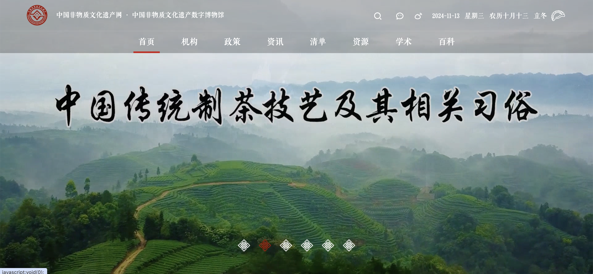
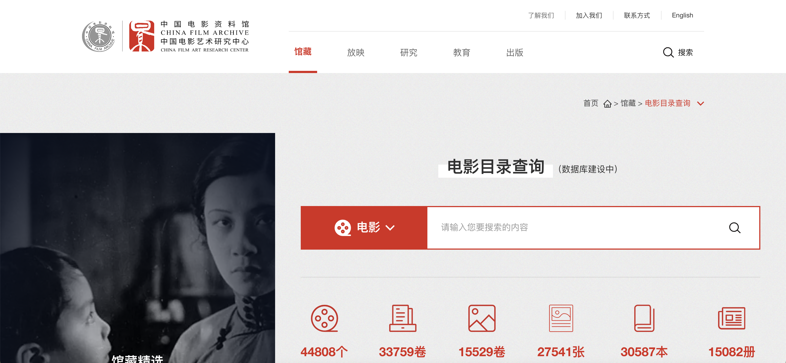

# 艺术学

## 中国艺术研究院艺术与文献馆

### 链接
[中国艺术研究院艺术与文献馆](https://lib.zgysyjy.org.cn)

### 简介
中国艺术研究院艺术与文献馆，原称中国艺术研究院图书馆，系2002年12月我院由恭王府迁入现址时，将院资料馆与院内戏曲、音乐、美术等研究所资料室合并组建而成。我馆藏品丰富，品类繁多，特别以收藏艺术类书刊、特种文献、特藏实物、音像档案著称。
馆藏古籍多为音乐、戏曲、美术等艺术类善本，其中不乏传世孤本或稀见的珍贵版本。还藏有古代和近现代名家书画作品、碑帖拓本、名家手稿等。2008年，图书馆被国家古籍保护中心授予“全国古籍重点保护单位”称号。
非书资料是我馆的收藏特色，包括音像档案、特藏实物、艺术图片等。馆藏艺术实物类型多样，包括：清代升平署戏衣、砌末和面具等戏曲类实物；以传世古琴和少数民族乐器收藏为主的中外乐器藏品等。馆藏音像档案载体类型丰富多样、内涵广泛且珍贵。其中，馆藏7000小时中国传统音乐音响档案于1997年入选联合国教科文组织（UNESCO）首批 “世界的记忆”（Memory of the World），并列入《世界记忆名录》。2003年，《民间音乐家阿炳六首乐曲原始录音》、《冼星海〈黄河大合唱〉手稿》入选第二批国家档案局中央档案馆《中国档案文献遗产名录》。

---

## 中国非物质文化遗产网·中国非物质文化遗产数字博物馆

### 链接
[中国非物质文化遗产网](www.ihchina.cn)

### 简介
国非物质文化遗产网·中国非物质文化遗产数字博物馆旨在利用数字化技术和网络平台展示、传播中国和世界非物质文化遗产的专业知识，展示我国深厚丰富的非物质文化遗产资源，提供非物质文化遗产保护工作的信息交流，凝聚非物质文化遗产保护实践的观念和理论共识，充分调动和利用全社会的学术、经济、舆论资源及社会公众的参与，以促进中国非物质文化遗产保护工作的全面健康开展。
同时，中国非物质文化遗产网·中国非物质文化遗产数字博物馆将及时地反映政府有关非物质文化遗产保护工作的政策、理念，以及学术机构和保护机构的研究成果、工作经验，为引导全国非物质遗产相关工作者、志愿者正确开展非物质文化遗产的保护与研究，提供一个有效的交流平台。

---

## 中国近现代书画印本数据集（华东师范大学数字人文研究支撑平台）

### 链接
[华东师范大学数字人文研究支撑平台](https://dhrc.ecnu.edu.cn/dhrsp/#/frontend/paint)

### 简介
数字人文研究支撑平台集合了多种数字人文语义化技术、数据集和工具，提供多样化数字人文研究支持服务。以书画资源为例,平台构建了书画资源语义化框架及应用，建设了中国近现代书画印本数据库。相关研究者可基于平台已建设的书画资源语义化框架及应用，实现对书画资源的数字化。
---

## 中国电影资料馆（中国电影艺术研究中心）

### 链接
[中国电影资料馆](https://www.cfa.org.cn/cfa/gz/dymlcx/index.html)

### 简介
中国电影资料馆（简称“资料馆”）1958年成立，是国家级电影专业档案馆，1980年成为国际电影资料馆联合会（FIAF）正式会员。1984年，原文化部文学艺术研究院（现中国艺术研究院）电影研究所并入资料馆，成立中国电影艺术研究中心（简称“艺术研究中心”），此后资料馆和艺术研究中心始终两块牌子一套人马办公。1985年开始招收电影历史及理论（现为戏剧影视学）硕士学位研究生，2010年设立博士后科研工作站，2018年增列艺术硕士专业学位（MFA）。
该馆负责收集、整理、研究、保管中国生产的电影片的底片素材、拷贝、电影剧本、分镜头剧本、完成台本以及剧照、海报、评介材料等有关电影创作生产过程中形成的档案和数据，也保管部分外国电影拷贝和有关文图数据，并提供利用。在电影档案的收集、利用、电影理论研究、国内外电影学术交流和电影教学、电影报刊出版工作等多个领域都得到了全面的发展，是以电影档案工作为核心、业务和功能多元化的电影文化事业单位。它更以世界上最大的关于中国电影影像资料的收藏成为国际电影资料界重要成员之一。该馆拥有两座大型影片资料库——北京电影资料库和西安电影资料库以及各种不同规模和档次电影放映厅、电影文图资料库、录像、光盘视听室。

