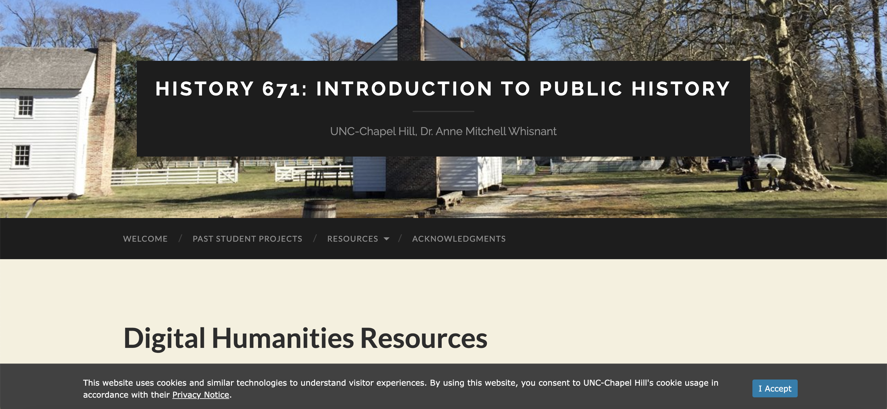
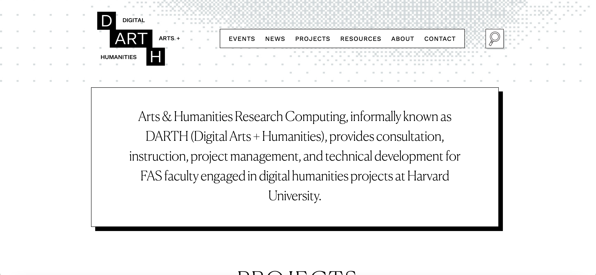
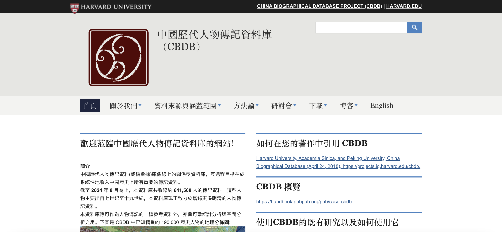
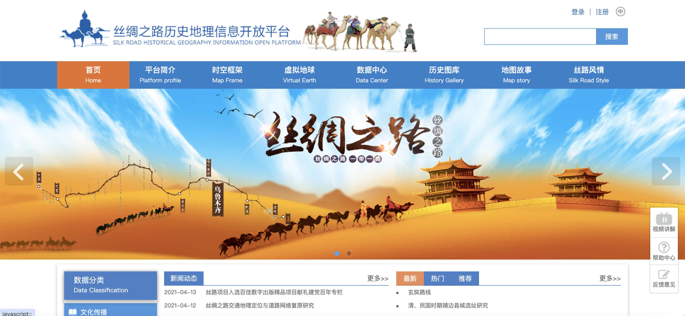
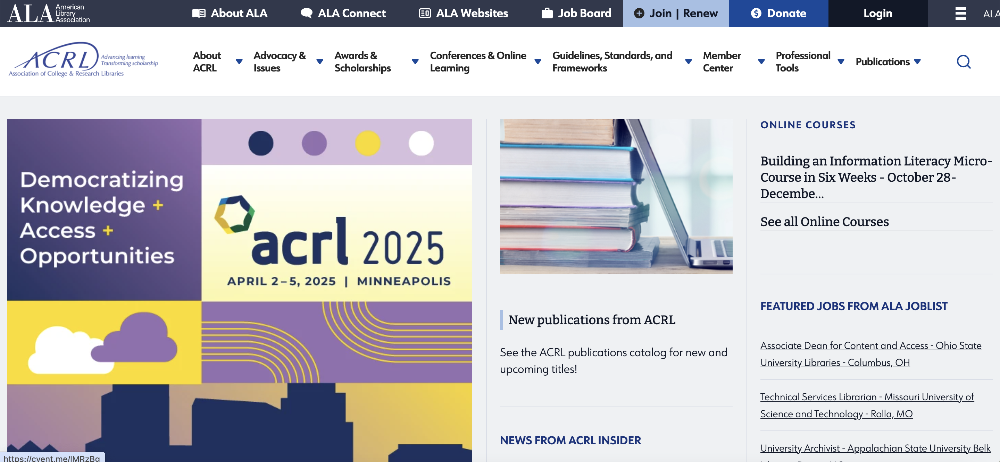

# 数字人文

## 中国数字人文DHCN

### 网址
[中国数字人文DHCN](https://www.dhcn.cn/)

### 简介
“中国数字人文”（DHCN）网站由清华大学数字人文项目团队创办，原名“数字人文门户网站”（DHLIB）；由中华书局、中国知网、国学网、中文在线等支持。作为综合性数字人文门户网站，DHLIB是中文世界的第一家，旨在为方兴未艾的数字人文研究提供一个“学术交流、开放获取、跨界交互、共建共享”的平台。

网站设置了一些栏目，如“机构”“期刊”“学人”“基础设施”“《数字人文》专栏”“论著成果”“教育教学”“社区”等，针对性地汇编信息并发布，用户可以一站式获取所有与数字人文有关的资讯。“教学视频”栏目转载各类课程和工作坊视频，“著作”栏目的长远目标是建立一座数字人文电子图书馆，“论文”栏目展示学术界利用数字人文手段进行研究的最新案例。建设数字人文智慧社区，让使用者可以进行线上实时交互，甚至组建团队，测试数据，分享众包。

---

## UNC-数字人文资源、项目、数据库

### 网址
[UNC-数字人文资源](https://publichistory.web.unc.edu/resources/understanding-digital-humanities/)

### 简介
该网站是由北卡罗来纳大学教堂山分校（University of North Carolina at Chapel Hill）提供的公共历史（Public History）资源页面的一部分，专注于数字人文学科（Digital Humanities）。提供了工具、资源和案例研究等。

---

## 华东师范大学调查与数字中心

### 网址
[华东师范大学调查与数字中心](http://dhrc.ecnu.edu.cn/dhaip)

---

## 华东师范大学数字人文研究支撑平台

### 网址
[华东师范大学数字人文研究支撑平台](http://dhrc.ecnu.edu.cn/dhrsp/#/)

### 简介
华东师范大学数字人文学科研究中心提供的数字人文学科研究平台，包含数据集、工具集等资源。

---

## 哈佛大学艺术与人文研究计算共享资源

### 网址
[哈佛大学艺术与人文研究计算共享资源](https://digitalhumanities.fas.harvard.edu)

### 简介
该网站是哈佛大学数字人文学科中心提供的资源页面，旨在为学术界和公众提供数字人文学科领域的各种资源和支持。它包括工具、项目、教程和其他有助于数字人文学科研究的资源。

---

## 中国历代人物传记资料库（CBDB）

### 网址
[中国历代人物传记资料库（CBDB）](https://projects.iq.harvard.edu/chinesecbdb/home)

### 简介
CBDB由哈佛大学开发，提供详尽的中国古代人物数据和信息，支持学术研究和历史分析。数据库包含人物生平、关系网络、时间轴功能等，便于用户进行深入的历史和文化研究。

### 主要特点:

历史数据整合: SRHGIS 提供了丰富的历史地理数据资源，包括古代地图、历史档案和地名信息。这些数据支持对历史时期的空间和地理变化进行研究。

空间分析工具: 平台集成多种GIS工具，允许用户对历史数据进行空间分析和可视化。用户可以创建地图、分析空间分布，并探讨历史数据的地理模式。

互动地图: 提供互动地图功能，用户可以通过地图浏览历史地理信息，查看不同时间段的地理变化和历史事件。

数据下载与访问: 用户可以下载平台上的各种数据资源，用于进一步的研究和分析。平台也提供了数据上传和共享的功能，支持研究人员和学者之间的合作。

项目展示: SRHGIS 收集了多个与历史地理相关的研究项目，展示了如何应用GIS技术解决具体的历史研究问题。

---

## 丝绸之路历史信息开放平台

### 网址
[丝绸之路历史信息开放平台](https://www.srhgis.com/homePage)

### 简介
丝绸之路历史信息开放平台是一个汇聚、整合和共享丝绸之路历史文化遗产资源的在线平台。该平台汇集了大量的丝绸之路相关历史文献、考古资料、图像视频等多媒体资源，为研究者提供了丰富的第一手和二手资料。运用现代信息技术，如大数据、云计算等，对丝绸之路的历史信息进行整理、分析和可视化展示，提升了研究效率。该平台旨在推动丝绸之路沿线国家和地区的历史文化研究，加强文化遗产保护与利用，促进文化交流与互鉴。

---

## ACRL（American College & Research Libraries）的数据实践（Data Praxis）

### 网址
[ACRL 数据实践](https://www.ala.org/acrl)

### 简介
ACRL维护的数据实践页面，提供数据管理、分析和应用方面的资源和指南.该页面旨在支持学术图书馆员、研究人员和数据专家在数据管理、分析和应用方面的工作。
