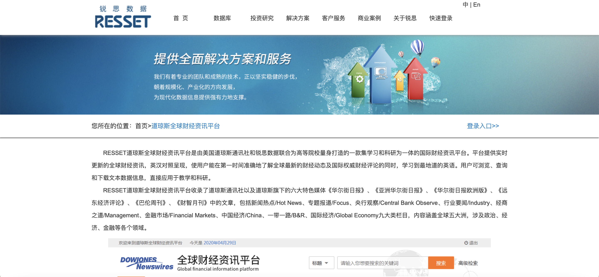
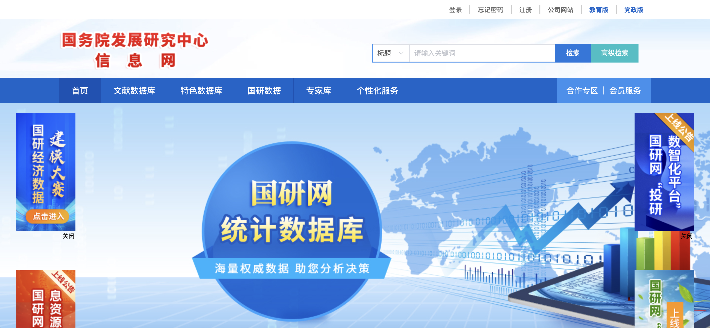
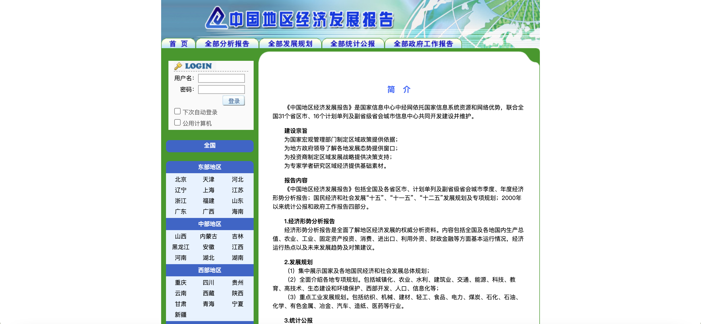
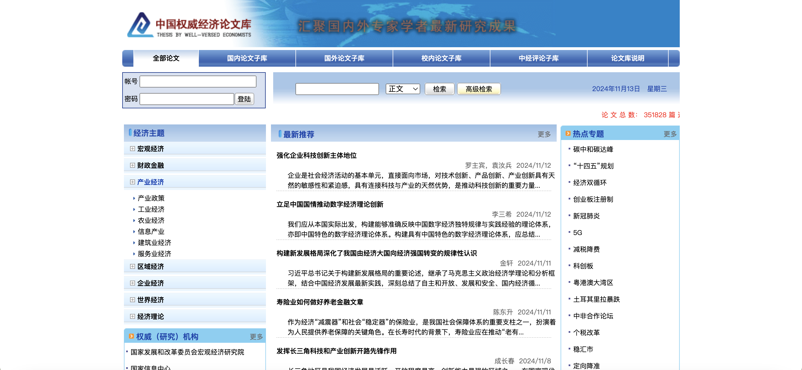
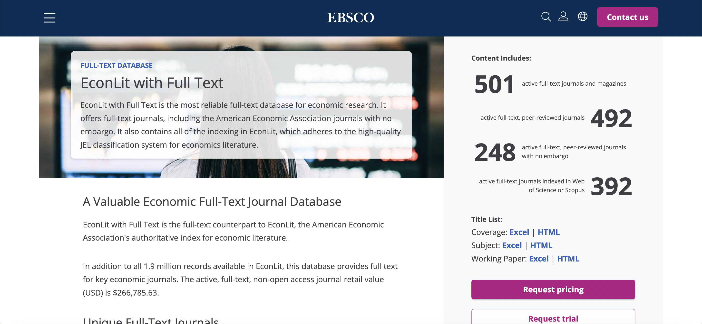
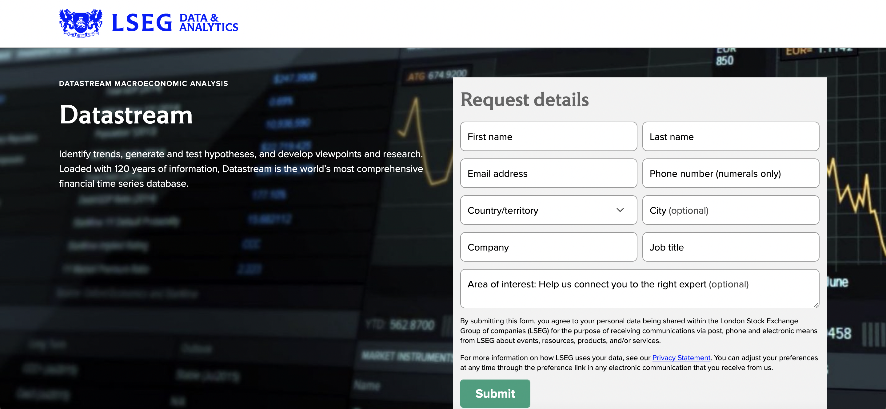
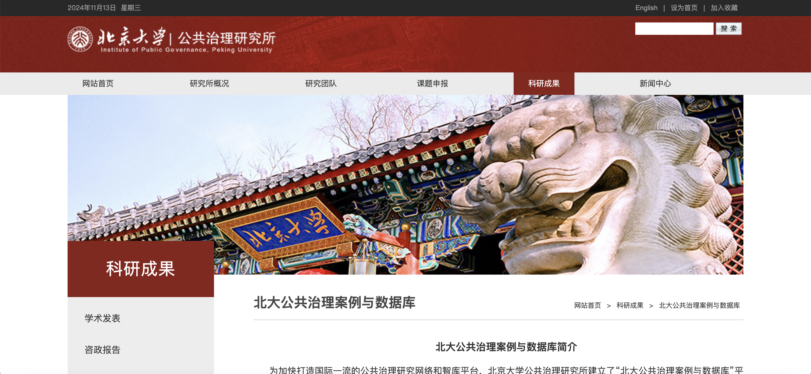
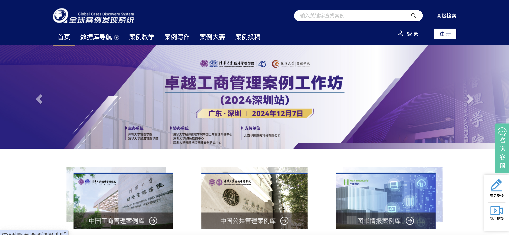
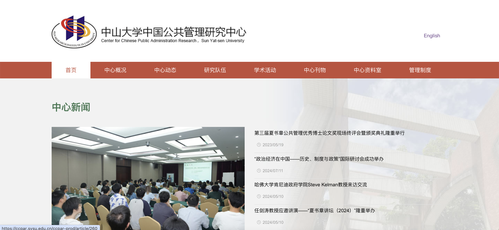

# 经济与管理 

## 经济学

### RESSET道琼斯全球财经资讯平台

网址：https://resset.cn/dqs

简介：RESSET道琼斯全球财经资讯平台是由美国道琼斯通讯社和锐思数据联合为高等院校量身打造的一款集学习和科研为一体的国际财经资讯平台。平台提供实时更新的全球财经资讯，英汉对照呈现，使用户能在第一时间准确地了解全球最新的财经动态及国际权威财经评论的同时，学习到最地道的英语。用户可浏览、查询和下载文本数据信息，直接应用于教学和科研。
RESSET道琼斯全球财经资讯平台收录了道琼斯通讯社以及道琼斯旗下的六大特色媒体《华尔街日报》、《亚洲华尔街日报》、《华尔街日报欧洲版》、《远东经济评论》、《巴伦周刊》、《财智月刊》中的文章，包括新闻热点/Hot News、专题报道/Focus、央行观察/Central Bank Observe、行业要闻/Industry、经商之道/Management、金融市场/Financial Markets、中国经济/China、一带一路/B&R、国际经济/Global Economy九大类栏目，内容涵盖全球五大洲，涉及政治、经济、金融等各个领域。

---

### 国务院发展研究中心信息网
网址：国研网-综合版 (drcnet.com.cn)

简介：国务院发展研究中心信息网由国务院发展研究中心信息中心主办，创建于1998年3月，是中国最著名的大型经济类专业网站。广泛与各类智库、研究机构合作，以“专业性、权威性、前瞻性、指导性和包容性”为原则，全力打造以宏观大数据产品、宏观经济业务软件、课题研究和咨询服务为核心的服务，为国家建设中国特色新型智库提供全方位信息技术支撑，为中国各级政府部门、研究机构和企业提供决策参考。

---

### 中经网-中国地区经济发展报告
网址：中国地区发展报告 ((http://dqbg.cei.cn/)

简介：《中国地区经济发展报告》是国家信息中心中经网数据有限公司推出的《中国地区经济资源库》子库之一。由中经网公司依托国家信息系统资源和网络优势，联合全国31个省区市、16个计划单列及副省级省会城市及部分地级城市信息中心共同开发建设并维护。
《中国地区经济发展报告》包括全国及各省区市、计划单列及副省级省会城市季度、年度经济形势分析报告；国民经济和社会发展“十五”、“十一五”、“十二五”发展规划及专项规划；2000年以来统计公报和政府工作报告四部分。

---

### 中国权威经济论文库
网址：中国权威经济论文库 (thesis.cei.cn)

简介：“中国权威经济论文库”是国家信息中心中国经济信息网利用其独特的信息资源和技术优势，为政府部门、教育科研机构和大中型企事业单位开发的具有强大检索、馆藏、自定义等功能的经济论文资料库。
“中国权威经济论文库”全部信息内容均来自海内外权威机构、著名经济学刊和专家学者的最新研究成果，分为5个子论文库：国内论文子库、国外论文子库、发改委成果子库、校内论文子库、中经评论子库 。

---

### 巨灵财经资讯系统
网址：巨灵财经 智能投研 (genius.com.cn)

简介：《巨灵财经资讯系统》是在中国证监会组织下，由深圳巨灵信息技术有限公司承建的财经资讯全文数据检索系统。内容涉及金融、证券、保险、财政、财务与会计、国民经济、国际贸易等专业领域。该数据库收录近300种国内外财经报刊，涵盖国内的财经金融报刊、行业报刊和港澳台新财经报刊，国内各大证券公司的研究报告和高校研究刊物，以及其他一些部门的内参资料；收录信息的时间覆盖为1998年至今，数据库每天更新。

---

### CCER经济金融研究数据库
网址：CCERDATA
简介：CCER中国经济金融数据库系统由北京大学中国经济研究中心和北京色诺芬信息服务公司联合开发，并在国内第一家推出基于互联网的BS数据服务平台，该服务系统不仅是目前国内最为全面的数据提供系统，全面涵盖了中国资本市场、货币市场、宏观经济及行业经济的所有研究领域资料，而且还为客户提供了很多周边的贴身服务。

---

### CSMAR数据库
网址：CSMAR
简介：CSMAR（China Stock Market & Accounting Research Database）数据库，全称为中国经济金融研究数据库，定位为研究型精准数据库，服务对象为以研究和量化投资分析为目的的学术高校和金融机构。CSMAR 数据库已涵盖因子研究、人物特征、绿色经济、股票、公司、海外、资讯、基金、债券、行业、经济、商品期货等18大系列，包含150+个数据库、4000多张表、4万多个字段。涵盖中国证券、期货、外汇、宏观、行业等经济金融主要领域，是投资和实证研究的基础工具。

---

### 财新网
网址：财新网 (caixin.com)

简介：Caixin Global - Latest Business and Financial News on China, U.S. Trade War and Negotiations, Breaking News, Headlines and Developments
财新网有机整合资讯、观点、多媒体、互动等信息时代形态丰富的资讯产品，以客观、专业的视角，实时输出高品质的原创内容，为中国政界、金融界、产业界、学界等社会精英提供每日必需的高品质财经新闻、资讯、评论，以及基础金融信息服务。财新英文网站提供在线新闻、播客及新闻电邮等产品。财新英文刊（Caixin-China Economics & Finance），内容涵盖财新传媒新闻解读与分析，针对新闻事件及人物的专题报道，为全球读者呈现中国经济图景。
 
---

### EMIS
网址：EMIS商业资讯 | EMIS
简介：EMIS（全球新兴市场商业资讯数据库）提供亚太地区、欧洲、中东、北非和南北美洲的超过180个国家和地区的全方位的市场动态和商务信息。EMIS整合了9000多种国内外信息资源、20000多份刊物，所有信息内容均由当地信息供应商直接提供并以英语和当地语言同时表现。

### 经禾中国研究数据服务平台
网址：上海经禾信息技术有限公司 (efindata.com)
简介：
上海经禾信息技术有限公司是中国大陆领先的金融大数据服务企业。旨在利用自身的技术和经验，为客户提供大数据产品和服务，开发基于资本市场的数据库、软件产品，并将这些产品推向市场。我们不仅关注资本市场的大数据挖掘、建模和分析，还向国内外高校和科研机构提供数据库服务。
在财经数据领域，经禾不仅使用最前沿的计算机分析技术，而且还与资本市场资深专家、国内外知名高校财经领域教授和学者合作，已建成国内完整、准确的大数据分析平台和财经数据仓库，数据内容涵盖股票、基金、研报、专利、微博、股吧、财经新闻等领域，并且不断扩展和实时更新财经数据信息以满足机构投资者的需求。针对金融业的投资机构、研究机构、学术机构、监管部门机构等不同类型客户的需求，经禾开发了一系列围绕信息检索、数据提取与分析等领域的专业分析软件与应用工具。通过经禾产品与服务，用户可以7x24x365获取到及时、准确、完整的财经新闻数据、最新资本市场动态信息和各种分析结果。

### CEIC经济数据
网址：[Global Databases, Economic Indicators & Forecasts | CEIC ](ceicdata.com.cn)
简介：CEIC经济数据提供覆盖全球近200个国家的宏观、行业经济数据，当前收录超过600多万条的时间序列数据以及涵盖各主要证券交易所的上市资讯财务数据。
提供的子库如下:全球经济数据库、中国经济数据库、世界趋势数据库、巴西经济数据库、俄罗斯经济数据库、印度经济数据库、印度尼西亚经济数据库、OECD数据库、Daily Database（日度经济数据库）。

### 中国微观经济数据查询系统
网址：中国微观经济数据查询系统 (sozdata.com)
简介：中国微观经济数据查询系统是由北京搜知数据科技有限公司提供的一款以企业层面的微观数据为基础，集数据查询、数据匹配、数据可视化于一体的数据查询系统，包含工业企业数据库、海关企业数据库、创新企业数据库、和绿色发展数据库四个数据库。

### EconLit with Full Text
网址：EconLit with Full Text | EBSCO: https://www.ebsco.com/products/research-databases/econlit-full-text

简介：EconLit with Full Text 是经济学研究最可靠的全文数据库。 它提供全文期刊，包括无延迟的美国经济学会期刊。 它还收录了 EconLit 中的所有索引，这些索引遵循了针对经济学文献的高质量JEL分类系统。

### Wind万得
网址：万得 - 经济数据库 (wind.com.cn)
简介：万得信息技术股份有限公司（下称：Wind）是中国大陆领先的金融软件服务企业。Wind在国内金融信息服务行业处于领先地位，是众多证券公司、基金管理公司、保险公司、银行、投资公司、媒体等机构不可或缺的重要合作伙伴； 在国际市场中，Wind同样受到了众多中国证监会批准的合格境外机构投资者（QFII）的青睐。 此外，知名的金融学术研究机构和权威的监管机构同样是Wind的客户；权威的中英文媒体、研究报告、学术论文也经常引用Wind提供的数据。

### 全球经济数据库手册
网址：联系我们 - 牛津经济研究院 (oxfordeconomics.com)

简介：全球经济数据库提供全面、一致的社会和宏观经济数据、趋势和预测，确保您获得做出明智选择所需的信息。 包括获取 200 多个国家的数百个指标，涵盖经济的主要领域，包括国内生产总值和国内需求、价格和工资、劳动力市场、贸易和国际收支、金融指标、社会经济和人口。

### Datastream
网址：Datastream 宏观经济分析 | LSEG (https://www.lseg.com/en/)

简介：Datastream是历史金融数据库，拥有超过 3500 万个独立工具或指标，涵盖包括 850 万个活跃的经济指标的所有主要资产类别。Datastream 汇集了 175 个国家/地区 120 年的数据，是您解读市场趋势、经济周期和世界事件影响所需的信息和工具。涵盖许多独一无二的内容，如 I/B/E/S 预估汇总、Worldscope Fundamentals、时间点数据和 Reuters Polls。
数据涵盖债券指数、债券、大宗商品、可转换债券、信用违约掉期、衍生品、宏观经济、能源、股票、股票指数、ESG、预估、汇率、固定收益、基金、基本面、利率和投资信托。
Datastream 可以作为数据馈送通过 API 访问，也可以集成到 Eikon 中，并带有 Microsoft Office 插件以便动态更新。用于 Matlab 和 Eviews 的 API 也可用于回测。

## 工商管理
### 中国工商管理案例库
网址：中国工商管理案例库 (https://casecenter.sem.tsinghua.edu.cn)

简介：中国工商管理案例中心致力于在工商管理教育中推动案例方法的运用与提升，传播案例开发、教学和学习方面的专业知识与经验。中心所运营的案例库已收录1,700余篇有关中国企业主题的教学案例，每年新增100篇以上。案例库内容丰富，涉及广泛的行业与工商管理学科。2013年，清华经管学院率先在国内将案例库投入商业化运营，该案例库目前已被150多家国内高等教育机构持续订阅。

### emerald
网址：Discover Journals, Books & Case Studies | Emerald Insight
简介：Emerald于1967年由来自世界著名百强商学院之一的布拉德福商学院（Bradford University Management Center）的学者建立。从出版唯一一本期刊开始，到至今成为世界管理学期刊最大的出版社之一，Emerald一直致力于管理学、图书馆学、工程学专家评审期刊，以及人文社会科学图书的出版。拥有来自100%世界百强商学院的作者及用户，100%世界200强综合性大学的作者及用户，以及近60%的世界500强企业用户。
包含281种专家评审的管理学术期刊，提供最新的管理学研究成果和学术思想学科覆盖：会计金融与经济学，商业管理与战略，公共政策与环境管理，市场营销，信息与知识管理，教育管理，人力资源与组织研究，图书馆研究，旅游管理，运营物流与质量管理，房地产管理与建筑环境，健康与社会关怀

### ABI/INFORM Complete
网址：ABI/INFORM Collection (proquest.com)
简介：ABI/INFORM Complete是一个专门用于商业和管理领域的学术数据库平台，由ProQuest公司提供。它涵盖了包括管理学、市场营销、金融、会计、人力资源管理等多个领域的文献资源。ABI/INFORM Complete提供了丰富的全文数据库，研究人员可以通过这些数据库获取大量的学术期刊、会议论文、书籍等资源。一个显著特点是其专注于商业和管理领域，研究人员可以通过ABI/INFORM Complete获取到最新的商业和管理研究成果，了解行业的最新发展动态。此外，ABI/INFORM Complete还提供了强大的文献检索功能，可以通过关键词、主题、作者、期刊等多种方式进行检索。

## 公共管理
### 中国公共管理案例中心
网址：中国公共管理案例中心 (http://case.sppm.tsinghua.edu.cn/)

简介：中国公共管理案例中心成立于2004年，作为清华大学公共管理学院教学、科研和培训工作的支撑机构，专业从事公共管理案例教学、案例开发、案例库建设并组织各类案例教学研讨活动，服务于中国公共管理领域的人才培养、理论创新与实践发展。中心成立清华大学公共管理学院南平案例研究中心，作为案例开发和教学的校外基地，成为了解基层实践情况、感知中国社会发展情境的触角。
2014年上线的“中国公共管理案例库”是案例中心精心打造的高品质教学案例库，面向全国教学机构提供案例教学服务，亦可作为政府部门和相关机构的智库平台，现收录220多个经典案例，已为1043所高校开通试用权限，为64所国内院校提供案例教学服务。所有案例基于实地调研和各类参考文献开发而成，经长期教学实践证明，课堂教学效果显著。

### 北大公共治理案例与数据库
网址：[北大公共治理案例与数据库-北京大学公共治理研究所](https://www.ggzl.pku.edu.cn/kycg/ggzlalysjk.htm)

简介：北京大学公共治理研究所建立了“北大公共治理案例与数据库”平台。该平台是公共治理领域的重要服务平台，旨在积极收集和开发国内外公共治理领域的经典案例和研究数据，推动公共治理研究案例与数据的开放、交流和共享，促进学术界与实务界的互动，助力北京大学政治学和公共管理学科的进一步发展和人才培养，并为全球公共治理领域的教学和科研工作提供有力支持。该平台不仅服务于北京大学校内师生，同时也面向国内外公共治理领域的研究者和相关机构开放；不仅支持平台用户浏览和下载数据，同时鼓励研究人员开放和共享数据。

### 全球案例发现系统
网站：全球案例发现系统 - 首页 (chinacases.cn)

简介：包含中国工商管理案例库，中国公共管理案例库，图书情报案例库等

### 中山大学中国公共管理研究中心
网址：中山大学中国公共管理研究中心 (https://ccpar.sysu.edu.cn/)

简介：中山大学中国公共管理研究中心（简称中心）于2000年12月25日成立。经过20多年发展，中心在科学研究、学术交流、社会服务等方面都取得了优异成就，成为国内公共管理学科研究的重要引领者、国际公共管理交流的发起者和积极参与者。中心通过品牌学术会议、访学计划、合作研究等方式，建立了多元化的学术交流渠道：（1）中心致力于高质量学术成果，在国际国内权威学术期刊持续推出高质量论文，并先后推出多个系列丛书和译丛。结合研究项目设计积极回应国家治理现代化的战略需求。（2）中心先后创（主）办《公共行政评论》（CSSCI）《中国公共政策评论》（CSSCI集刊）《数字治理评论》以及Chinese Public Administration Review 等高水平学术期刊，为学术共同体建设搭建公共服务平台。（3）中心坚持点线面结合开展各类学术活动，拓展多元化国内外交流合作形式，引领学术前沿，形成如“华人公共管理学者研讨会”“中国城市管理高峰论坛”等具有广泛影响力的品牌会议。（4）创立全国性权威学术奖项——夏书章公共管理优秀博士论文奖，发掘和奖掖公共管理学科领域的优秀后辈人才。（5）与新华社中国经济信息社、科大讯飞等机构合作，以政务热线为焦点，推动全国政务服务数字化智能化转型。（6）持续推出《人民美好生活需要与社会政策创新》和《公共治理的数字化转型》两大年度研究报告。
