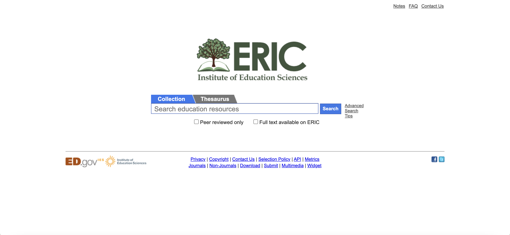
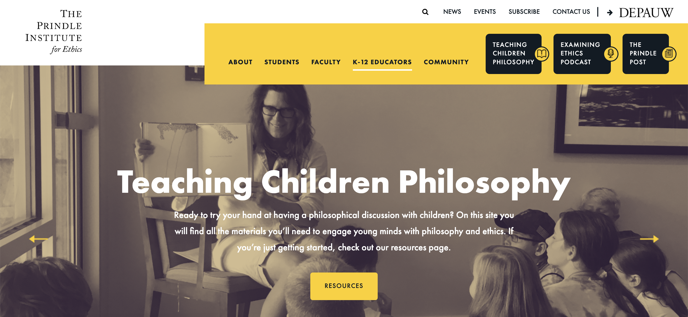
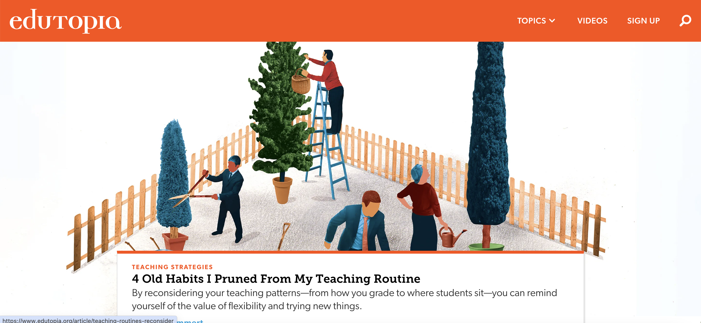
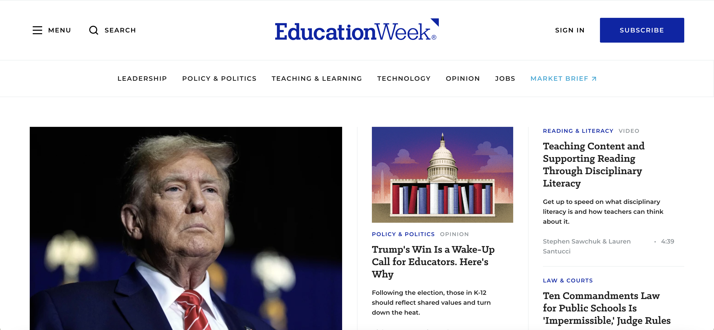
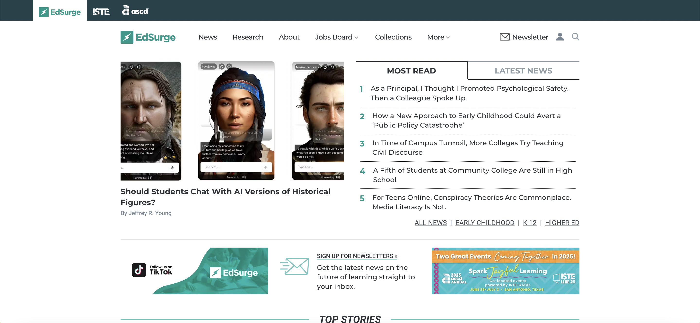

# 教育
## 教育学
### 教育资源信息中心 Education Resources Information Center (ERIC)
网站链接：https://eric.ed.gov/

数据库：SPORTDiscus with Full Text
简介：ERIC教育资源信息中心（Education Resources Information Center）是一个权威的索引和全文教育文献和资源数据库。它由美国教育部教育科学研究所赞助，是各种教育研究人员的重要工具，提供大量关于教育研究的文献、论文、报告等资源。用户可在该网站上可以搜索到包括教学学在内的各种教育学研究资源，并且有数据库可以检索相关内容，每篇论文都会列出相关的参考文献，方便查阅。
相关论文：
[1]ERIC - the Education Resources Information Center. International Journal of Physical Education. 2009;46(1):41. Accessed July 18, 2024. 

---

### Teaching Children Philosophy
网站链接：http://www.teachingchildrenphilosophy.org/

简介：Teaching Children Philosophy提供针对儿童的哲学教育资源，该网站上有可以免费下载的教育资源，帮助教师和家长引导孩子进行哲学思考。对向小学生教授哲学和伦理学感兴趣吗？该网站有200多份讨论指南，旨在帮助用户使用流行的儿童图画书介绍哲学和道德规范，每份讨论指南都将为教育工作者介绍图画书中的关键哲学或伦理问题。这些指南还提供了一些问题，以帮助与幼儿展开哲学讨论。用户可在网站填写推荐表推荐图书，创建新的指南，为一本书开发自己的模块，提交自己的原始图书模块。
相关论文：
[1]Makaiau AS, Tanaka N. Philosophy for Children: A Deliberative Pedagogy for Teaching Social Studies in Japan and the USA. Journal of International Social Studies. 2018;8(2):29-54. Accessed July 18, 2024.
[2]Melbourne Univ. (Australia)., Victorian Philosophy for Children Association (Australia)., Australian Council for Educational Research H. Philosophy for Children and the Teaching of Thinking. Conference Report of the National Conference on Philosophy for Children (1st, Melbourne, Victoria, Australia, July 12-16, 1991)
[3]Rahdar A, Pourghaz A, Marziyeh A. The Impact of Teaching Philosophy for Children on Critical Openness and Reflective Skepticism in Developing Critical Thinking and Self-Efficacy. International Journal of Instruction. 2018;11(3):539-556. Accessed July 18, 2024.

---

### Edutopia 
网站链接：https://www.edutopia.org/

数据库：ERIC
简介： Edutopia是由乔治·卢卡斯教育基金会支持的一个教育网站，致力于推动教育改革和教学创新。该网站提供教育实践、资源、视频和研究，旨在帮助教师拓展教学技能并提升学生学习成果。用户可以浏览网站上的教育实践文章、教学资源、教师故事和视频，以获取有关创新教学方法、班级管理技巧和学生激励的实用建议。Edutopia还提供在线社区和专家论坛，用户可以在这里分享经验和互相学习。
[1]Nilgun Tosun, Soner Altintas. An Evaluation of Teachers’ Views on Open Educational Resources. Turkish Online Journal of Distance Education. 2024;25(2):59-75. Accessed July 18, 2024.
[2]Kwadwo Asante, Petr Novak. When the Push and Pull Factors in Digital Educational Resources Backfire: The Role of Digital Leader in Digital Educational Resources Usage. Education and Information Technologies. 2024;29(6):6553-6578. 

---

### Education Week
网站链接：https://www.edweek.org/

数据库：ERIC
说明：Education Week是一个教育新闻与分析平台，提供有关教育政策、实践和研究的全面新闻报道和分析，涵盖了从K-12教育到高等教育的各个方面，网站内容包括学校管理、教学方法、评估制度、教育技术等多个议题，帮助读者全面了解教育领域的最新动态。Education Week的主要用户群体包括教育工作者（如教师、校长、教育行政人员等）、政策制定者、研究人员以及其他教育产业相关人士。Education Week经常推出专题项目，如“The State of Teaching”等，旨在深入探讨教育领域的特定问题，并提出改进建议，这些项目通常基于独家数据和实地报道，具有高度的权威性和实用性。Education Week鼓励读者参与讨论和分享观点，设有论坛和社交媒体链接等功能，方便读者与其他教育工作者和专家进行交流，通过这种互动方式，读者可以拓宽视野、交流经验并共同进步。
相关论文：
[1]Editorial Projects in Education (EPE). How Reading and Writing Fuel Each Other. Education Week. Spotlight. Editorial Projects in Education. January 2024.
[2]Editorial Projects in Education (EPE). Inclusion & Equity. Education Week. Spotlight. Editorial Projects in Education. January 2024.

---

### EdSurge 
网站链接：https://www.edsurge.com/ （注：由于网络限制，国内用户可能需要特定方式访问）

数据库：Academic Search Premier
说明简介：EdSurge是一个知名的教育科技资源平台，专注于为教育工作者、政策制定者、创业者以及教育技术爱好者提供最新的教育科技新闻、产品评测、趋势分析和在线社区服务。用户可通过其新闻资讯服务及时了解教育科技领域的最新动态和趋势。并根据需求分类查找和了解各类教育科技产品。EdSurge的用户群体广泛，包括教育工作者（如教师、校长、教育行政人员等）、政策制定者、教育技术创业者、投资者以及教育技术爱好者等，通过EdSurge的活跃在线社区获取最新的教育科技资讯、了解产品性能、交流经验和想法，共同推动教育科技的进步和发展。
相关论文：
[1]Harris A, Wright S, Young S, Aniefuna M. For Black Women Educators, Affinity Groups Forge Connection: An EdSurge research project shows how identity-based teacher affinity groups can be healing and agentic spaces. Educational Leadership. 2024;81(8):46-50. Accessed July 18, 2024.

---
