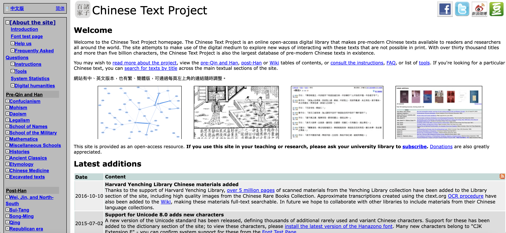
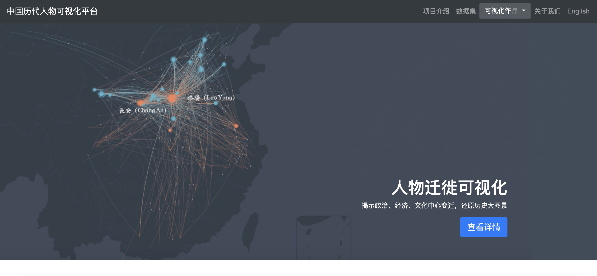
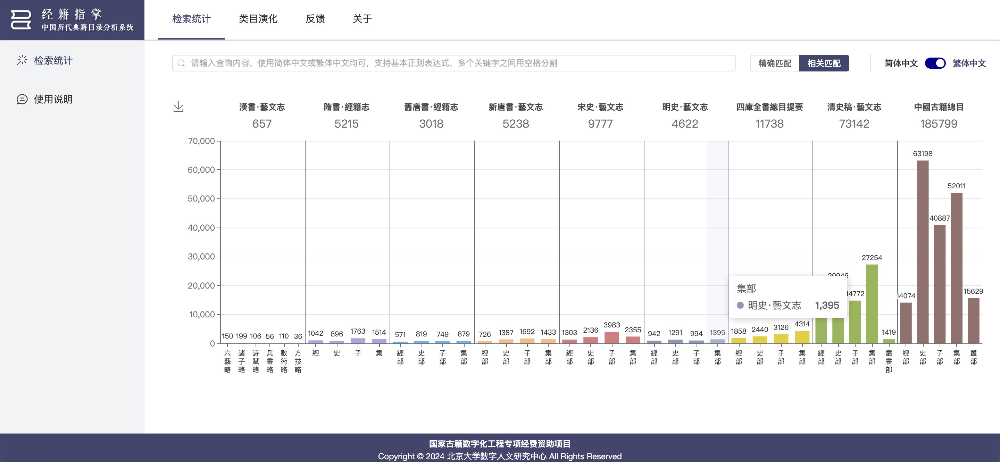

# 历史学
## 历史学
### 中国哲学书电子化计划（英文：Chinese Text Project）
**链接：**[中國哲學書電子化計劃 (ctext.org)](http://ctext.org/zh)

**简介：** 中国哲学书电子化计划是一个线上开放电子图书馆，为中外学者提供中国历代传世文献，力图超越印刷媒体限制，通过电子科技探索新方式与古代文献进行沟通。收藏的文本已超过三万部著作，并有五十亿字之多，故为历代中文文献资料库最大者。 欢迎参阅先秦两汉、汉代之后或维基区资料库目录，或参考系统简介、常见问答集、使用说明和相关工具。若欲寻找特定著作，可使用书名检索功能一并检索本站各种主要原典资料。
**使用说明**
**全文搜索**
要进行全文搜索时，先确认浏览器中打开的网页属于网站“原典全文”的部分，然后在左下角的“搜索”框内选择搜索范围并输入所要搜索的字词。（如：学而时习之）且点击“搜索”。全文资料库支持使用多数的搜索条件；在不同搜索条件之间输入半角空格分割（如：学而时 不亦君子），系统将会列出所有同时符合所有搜索条件的段落。若要搜索含有空格的英文词组，在词组外加上英文引号（如："Mozi said"）。点击“高级搜索”可以使用更有弹性的搜索方式。
**辞典搜索**
要进行辞典搜索时，先确认浏览器中打开的网页属于网站“辞典”的部分，然后在左下角的“搜索”框内输入所要查询的字词。（如：学）且点击“搜索”。当输入的文字不作为辞典中的项目时，系统将会以表格的方式为被输入的每一个汉字列出辞典中的资料。
**研究资料搜索**
要进行研究资料搜索时，先确认浏览器中打开的网页属于网站“研究资料”的部分，然后在左下角的“搜索”框内输入所要查询的字词。（如：Ethics）且点击“搜索”。点击“高级搜索”可以使用更有弹性的搜索方式。
**连接到本站的内容**
您可以直接使用浏览器所显示的网址来建立至本站任何网页的连接。若想要指出其中一个段落，先点击段落左手边的段落号，这就会把浏览器中的网址改爲突出此段落的连接。
**使用浏览器直接搜索**
如果想要更快速更方便地搜索原典资料库或辞典，您可以把本站的搜索功能增加到任何支持Opensearch的浏览器上（含Firefox 2或以上和Internet Explorer 7）。如果想要增加搜索功能：
*最新版浏览器 - 点击下列的链接：加字典搜索、加先秦两汉搜索
Firefox（旧版） - 点击浏览器视窗右上中搜索栏左边的图标，选择所想要增加的搜索类型。
Internet Explorer - 点击浏览器视窗右上中搜索栏左边的图标，选择“Add Search Providers”，再选择所想要增加的搜索类型。*
第一次增加搜索功能时，新的搜索方式会被设定为有效的搜索方式。搜索时，只要确认您所想要使用的搜索方式已被设定为有效搜索方式，在浏览器的搜索栏中输入搜索条件，再点击搜索栏右边的搜索图标即可。
请注意：当您增加此一功能之后，搜索结果所使用的显示模式（如：中文提示及简体字、英文提示和繁体字）将会是您增加时所使用的显示模式。如果想要改变搜索所使用的显示模式，请把搜索功能从浏览器中删除，改变了显示模式之后重新增加。
**数位人文工具:**
**CTP API（应用程式介面）**
中国哲学书电子化计划应用程式介面（CTP API）可用于文本挖掘和其它数位人文研究目的，亦可用于扩充一般使用介面的功能，使本站文本内容能直接在相关外部工具内使用（如下述的Text Tools、MARKUS工具等）。
应用程式介面可用在任何程式语言里面。为Python设计的官方组件可用于数位人文教学和研究。另外，Digital Sinology网站上有一系列教程说明如何利用Python组件读取本站文本内容。
**关联开放数据和语义网**
本站数据维基的内容提供批量下载，以便进一步分析和研究。
**Text Tools（文本工具）**
Text Tools插件提供文本资料的分析、视觉化的强大功能，包括自动分析重见资料内容、正规表示式、n元语法等等。以下有视觉化结果的例子，其具体说明请参考Digital Sinology（数位汉学）网站上有关重见资料和正规表示式的介绍以及dsturgeon.net上的自习教程。
**MARKUS**
由Brent Ho和Hilde De Weerdt开发的MARKUS平台提供线上工具自动或手动标记命名实体（含历代文献中的人名、地名、时间、官名等）。相关插件使得MARKUS能够自动读取本站的文本内容，即时开始进行标记。

**相关论文**
- Sturgeon, D. Unsupervised Identification of Text Reuse in Early Chinese Literature, Digital Scholarship in the Humanities, 2017.
- Sturgeon, D. Unsupervised Extraction of Training Data for pre-Modern Chinese OCR. 30th International Florida Artificial Intelligence Research Society [FLAIRS] Conference, 2017.
*另外参考：dsturgeon.net上的学术演讲。*

---

### 中国历史人物资料库(CBDB)
**链接：** https://inindex.com/biog

**简介：** 中国传记数据库是一个可免费访问的关系数据库，截至 2024 年 2 月，约有 535,181 人（目前主要来自 7 世纪至 19 世纪）的传记信息。通过在线和离线版本，这些数据旨在用于统计、社交网络和空间分析，并作为一种传记参考。下图显示了CBDB中190,000人的跨朝代子集按基本隶属关系（籍貫）的空间分布.CBDB的长期目标是系统地包括中国历史记录中所有重要的传记材料，并使其内容免费，不受限制地用于学术用途。这些数据正在定期得到丰富，并为唐、五代、辽、宋、晋元、明、清等人物创建新的传记条目。
CBDB 社区版在线查询系统是一个开源项目，所有的代码都在 GitHub 代码仓库上公开。该项目由北京大学数字人文研究中心、哈佛大学费正清中国研究中心 CBDB 项目组共同组成联合团队，并与台湾中研院进行合作，对 CBDB 在线系统进行重构。项目旨在通过提供更便捷的 CBDB 接入方式和更简洁的操作方式，以增强用户体验。

**数据集来源**
截至2024年2月，CBDB已涵盖中国历史上535,181篇传记。CBDB从以下来源查找数据：
- 传记数据的现代综合
宋人傳記資料索引
元人傳記資料索引
明人傳記資料索引
清代人物生卒年表
- 传统传记记录
正史列傳
墓誌銘、墓表等
地方志列傳
- 文学收藏中社会协会的证据
文集之祭文、序、記、墓誌銘，題跋， 書簡等
- 来自现代和传统来源的公职证据
郡守年表
會要、實錄等
- 其他传记数据库
明清妇女著作 （MQWW）
Ming Qing Name Authority文件
Pers-DB唐人知识库（京都）
 
**使用说明**
https://projects.iq.harvard.edu/sites/projects.iq.harvard.edu/files/cbdb/files/cbdb_users_guide.pdf

**相关论文**
- 陈志武， 詹林， 张晓明.2024. “对冲绝望：亲属网络如何减少中国历史上的同类相食”。 比较经济学杂志52（2）：361-82。https://doi.org/10.1016/j.jce.2024.01.003。

- Li， Bin， Yiguo Yuan， Xuehui Lu， and Peter K. Bol. 2024.“亲属关系正常化以丰富家庭网络分析——中国传记数据库案例研究”。人文学科数字学术 39 （1）.https://doi.org/10.1093/llc/fqad108。

- Wan， Jing， Hao Zhang， Jun Zou， Ao Zou， Yubin Chen， Qingyang Zeng， Xinrong Li， and Qiya Wang.2024. “WuMKG：中国书画多模态知识图谱”。遗产科学12（1）：159-18。https://doi.org/10.1186/s40494-024-01268-4。

- 董宝敏和程博文。2024. “新儒家思想与中世纪中国科学技术的兴起”。经济史评论。https://doi.org/10.1111/ehr.13325。

---

### 中国历代人物可视化平台
**链接：** https://cbdb-qvis.pkudh.org/home.html

**简介：** 
- 研究背景
本项目在“中国历代人物传记资料库”（CBDB）的基础上提供了可视化的数据分析和交互查询等工具，为大众提供更直观、更有趣的史学知识呈现方式。本平台亦可作为专业研究人员的研究工具，探索自己感兴趣的课题。
本平台所提供的可视化交互和查询操作，集成了数据清洗和分析的工作，方便用户对历朝各代的历史人物和学术传承做对比和分析，专注于学术研究问题的探索。CBDB数据集作为一个大规模开放数据集，仍在不断录入更多的历史数据。本项目将随着CBDB数据的增长而持续完善，也希望大家提出进一步的完善建议。
- 研究内容
平台的第一部分是“历史人物迁徙图”，旨在对中国历代重要人物的迁徙路径进行可视化，而众多迁徙路径的汇聚恰恰能反映当时政治中心和文化中心变迁，以及政治文化中心对周边城市的集聚效应。此处的一条迁徙路径指一个人的出生地（若无则为籍贯地）至其死亡地（若无则为最后所知地）的有向边，通过对生死地、迁徙路径、城市生死人数差异进行视觉编码，可以还原出生动壮阔的历史图景。此外，单独对“唐代历史人物迁徙”进行了按年份展示。
平台的第二部分是“学术师承可视化”。中国自古重师道，门人群体是传播学术思想的重要力量。本平台通过静态的树状图和动态的网络图来呈现士人的学术师承关系，帮助用户理解学术传承脉络的衍变。本平台进一步对门人群体的籍贯分布可视化，以展示其学术影响力的范围；对门人的官职信息分布进行统计，以展示其门人的仕途成就。

**数据集来源：** CBDB数据库

---

### 经籍指掌——中国历代典籍目录分析系统
**链接：** https://bib.pkudh.org/

**简介：** 《经籍指掌——中国历代典籍目录分析系统》是由北京大学数字人文研究中心与中国科学院自然科学史研究所联合研发的一套针对中国历代典籍目录之间类书与书目之间关系的可视化分析系统。项目属于“国家古籍数字化工程专项经费资助项目”。系统对历朝史志目录、《四库全书总目》、《中国古籍总目》等九种代表性官修目录的数据进行标准化处理与书目认同，并利用可视化手段对各目录之间的关系进行呈现。
利用该系统，学者可以方便地对各目录进行检索，直观地查看各目录中书目的分布情况以及各类目的具体收书情况，同时查看与分析目录子类中所收录的具体典籍分类演变情况。该系统在保留古籍目录图书分类和考察学术源流的基础上引入定量分析，不仅可以帮助学者探究古籍目录的分类演化及其背后的学术流衍为核心研究问题，而且借助交互式的可视化分析手段可以支持学者的检索、统计、分析等研究需求。

**数据集来源**
本项目的数据集包括七部正史的史志目录，即《汉书艺文志》、《隋书经籍志》、《旧唐书经籍志》、《新唐书艺文志》、《宋史艺文志》、《明史艺文志》、《清史稿艺文志及补编》、《四库全书总目提要》，以及《中国古籍总目》，贯穿了从汉朝到近代的主要历史时期，总条目近 30 万条。

---

### 《国家珍贵古籍名录》知识库
**链接：** https://rarebib.pkudh.org/
**简介：** “《国家珍贵古籍名锝》知识库”为“中华古籍保护计划”成果之一，是全国古籍整理出版规划领导小组批准的2021年度国家古籍数字化工程专项经费资助项目。 本知识库是由中国国家图书馆（中国国家古籍保护中心）申请立项，与北京大学数字人文研究中心联合设计开发的成果。 知识库中的古籍图文资料由中国国家图书馆（中国国家古籍保护中心）授权提供。
本知识库旨在藉由交互式可视化技术与关联语义技术实现对《国家珍贵古籍名锍》收锍古籍的多维度查询与探索。 名镘介绍页面依次从名镘批次、时间（名镘收镘古籍的版本朝代分布）、空间（名镘收锈古籍的收藏机构地理分布）展开，结合多种可视化方式展示《国家珍贵古籍名镘》各方面内容。 名镙浏览页面结合多字段检索与多维度导航功能，为用户提供了解古籍的入口与工具; 两种查阍名镘收镬古籍的方式，一方面支持用户精确查询，另一方面便于用户从文献类型、文种、版本朝代、版本类型四个维度联合筛选，逐步探索名镘收铼古籍之丰富内涵。 名镘分析页面充分利用关联语义技术，呈现名锍中隐含的人物关系与书目关系，结合统计功能帮助更多用户进一步深入探索。
本知识库一方面为大众打造了一种全新的了解、阅读、探索《国家珍贵古籍名锍》及其收锈古籍的体验，为互联网环境下《国家珍贵古籍名锍》的查阍提供了新的路径; 另一方面，在展示《国家珍贵古籍名锍》各方面内容的同时，也为专业用户提供了知识化、语义化的分析和研究工具，以此助力学术研究。

---
