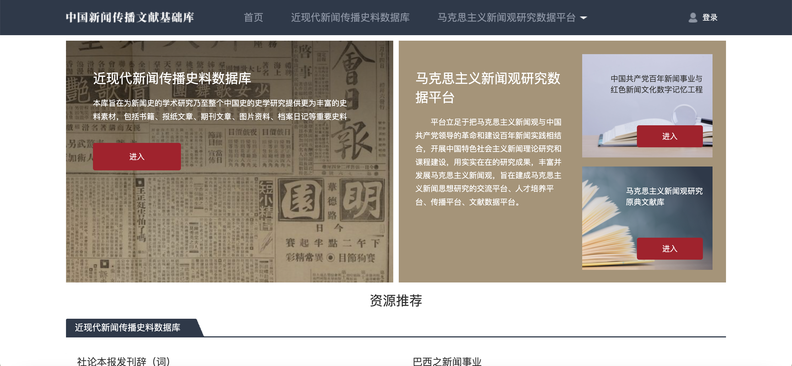
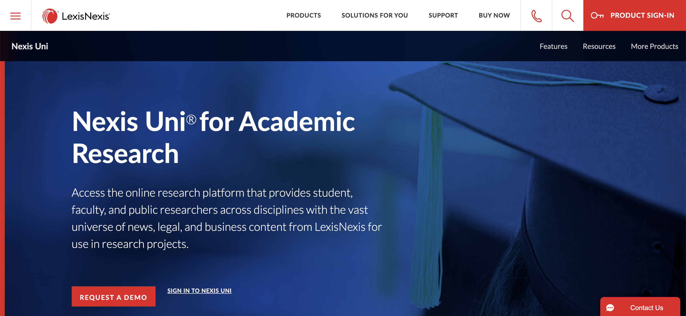
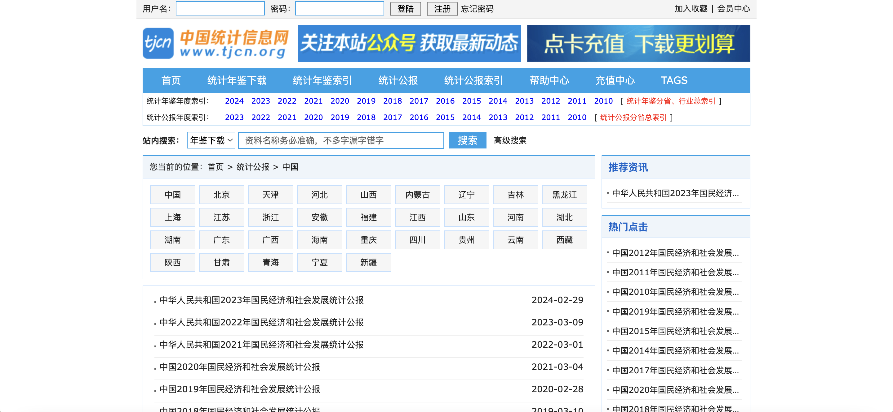
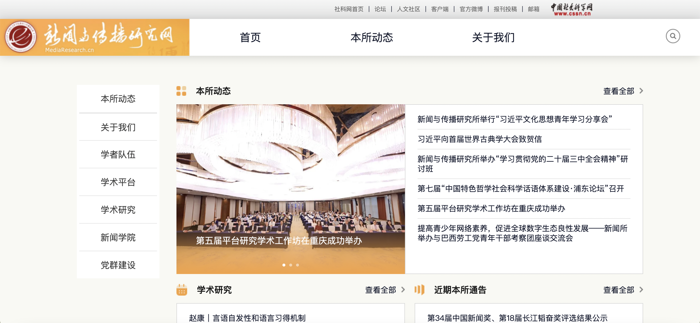
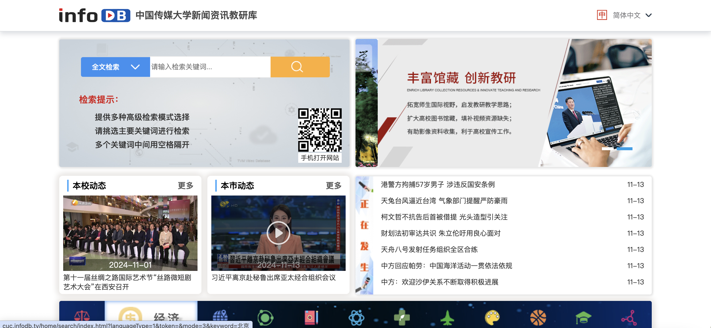

# 新闻与传播学
## 新闻与传播学
### CMMC新闻传播学子库
网址：[Communication & Mass Media Complete | EBSCO](https://www.ebsco.com/products/research-databases/communication-mass-media-complete)

简介：Communication & Mass Media Complete 持续收录 966 种索引和摘要类期刊。 其中 937 种经过同行评审。 Communication & Mass Media Complete（CMMC）是一个强大的传播学研究数据库。 它提供诸多顶级传播学期刊的全文、索引和摘要，涵盖所有相关学科，包括媒体研究、语言学、修辞学和话语。
该库收录近300多种各类报刊传媒(涵盖美国各州报纸、国际各大报如Christian Science Monitor, U.S.A Today, The Washington Post等）全文及The New York Times和The Wall Street Journal - Eastern Edition索摘。（回溯1995年）（全文型数据库）

---

### CND中文新闻数据库
网址：锐研数据-新闻专题数据库 (ringdata.com)
简介：CND中文新闻数据库是萌泰数据联合南京大学新闻传播学院合作研发的面向社会科学研究的中文新闻数据库。数据库采集来自互联网上公开的门户网站、报纸、公众号和App等不同数据来源的中文新闻，并提取新闻的时间、空间、人物、机构、事件、主题、情感、影响力、词频等关键指标，形成结构化的可供分析研究的数据库。中文新闻数据库包括国内外所有中文新闻报道，提供新闻内容主题分类， 从新闻中提取时间、地点、人物、机构、主题、情感、影响力等各类结构化变量。 新闻数据来源覆盖国家网信办公布的可供新闻转载的380家新闻单位（含报纸和网站）、 各级省市的地方媒体、知名微信公号等。可按主题、时间、来源进行分类筛选。 提供新闻可视化分析和新闻指数查询工具。

---

### 中国新闻传播文献数据库
网址：中国新闻传播文献数据库首页 (ruc.edu.cn)

简介：包含近现代新闻传播史料数据库及马克思主义新闻观研究数据平台，该库旨在为新闻史的学术研究乃至整个中国史的史学研究提供更为丰富的史料素材，包括书籍、报纸文章、期刊文章、图片资料、档案日记等重要史料以及立足于把马克思主义新闻观与中国共产党领导的革命和建设百年新闻实践相结合，开展中国特色社会主义新闻理论研究和课程建设，用实实在在的研究成果，丰富并发展马克思主义新闻观，旨在建成马克思主义新闻思想研究的交流平台、人才培养平台、传播平台、文献数据平台。

---

### LexisNexis Academic
网址：[LexisNexis® Academic Asia & Library Solutions](https://www.lexisnexis.com/en-us/professional/academic)

简介：LexisNexis Academic 提供广泛而全面的学术资源，包括新闻、商业资讯、法律材料、医疗信息等等，提供超过5600种全文资料，來源包括了新闻、报纸、广播、网站等媒体，以及商业公司的情报、财务数据等资料，LexisNexis Academic 甚至还能连接到著名的谢法德美国最高法院判例摘引(Shepard's Citations®)，查询自1789年以來的联邦法院案例。

---

### 中国统计信息网
网址：http://www.tjcn.org

简介：国家统计局的官方网站，汇集了海量的全国各级政府各年度的国民经济和社会发展统计信息，建立了以统计公报为主，统计年鉴、阶段发展数据、统计分析、经济新闻、主要统计指标排行等。

---

### 中国社会科学院新闻与传播研究所
网址：新闻与传播研究网 (cssn.cn)

简介：新闻与传播研究所承担着我国新闻学、传播学基础理论研究和现实对策性研究的重任，经过几代人的共同努力，已成为我国新闻学、传播学以及网络新媒体研究领域的学术重镇、党和政府在该领域首选的“智囊团”和“思想库”。开展主要业务内容包括马克思主义新闻学研究、传播学研究、互联网新媒体研究，以及相关培训及学术交流与咨询。同时，拥有三种定期出版物：学术月刊《新闻与传播研究》、大型年刊《中国新闻年鉴》和年度蓝皮书《中国新媒体发展报告》。

---

### 慧科搜索新闻研究数据库
网址：WiseNews (wisers.net)
简介：慧科搜索新闻研究数据库由香港慧科讯业创建，香港特区政府和香港中文大学斥资成立。数据库致力于满足用户对新闻搜索/浏览、新闻传播分析、案例研究的需求，在满足对新闻全文数据的需求下，帮助用户研究事件传播特点、分析特定媒体/版面新闻报道、发现用户关注的热点新闻以及高效进行新闻检索。该库可搜索1000 多种平面媒体和6000 余种网站新闻，收录的新闻资料最早可回溯到1998 年，为用户提供了珍贵的历史资料。

---

### TVMVDB中国传媒大学新闻资讯教研智库
网址：中国传媒大学新闻资讯教研智库 (infodb.tv)

简介：TVMVDB中国传媒大学新闻资讯教研智库实时收录全国200余家主流电视台自2009年至今的极具研究价值的视频资讯案例，囊括了社会各领域在发展过程中发现的新问题、新知识、新经验与新观点。数据总量逾1.8亿条，且以日增3万条的速度持续更新。教研库是国内唯一实时更新的新闻视频检索平台，涵盖时政、国际、财经、法治等十二大领域资讯，并定期更新相应领域的最新最热词条，可满足高校师生查阅新闻资讯、拓宽国际视野、查找论文资料、辅助课题研究、社会舆情分析、传播案例研究、剪辑素材获取等需求，有助于培养跨学科交叉融合的复合型专业人才。

---
