# 语言文学
## 语言学
### 世界语言资源平台

网址：https://languageresources.github.io
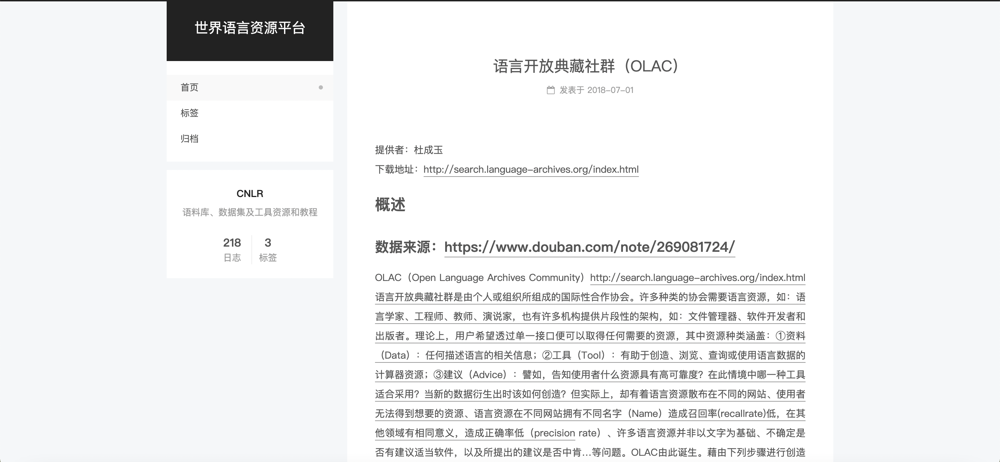

**简介：**
世界语言资源平台收集了218个语料库、数据集及工具资源和教程，提供有详细的访问网址、数据来源、相关论文等信息。

---

### 国家语委现代汉语通用平衡语料库

网址：https://cascorpus.com/link-detail/542132
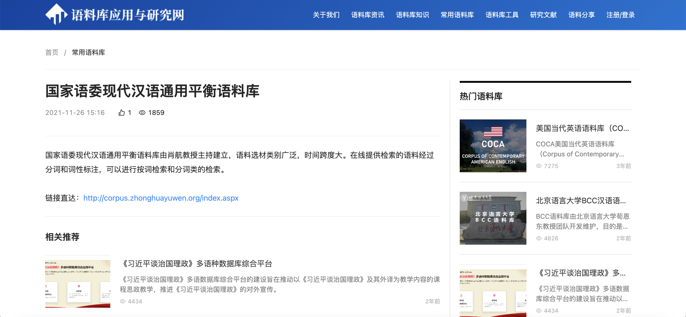

**简介：**

国家语委现代汉语通用平衡语料库是由国家语言文字工作委员会主持，面向语言文字信息处理、语言文字规范和标准的制定、语言文字的学术研究、语文教育以及语言文字的社会应用，总体规模达1 亿字，语料时间跨度为1919-2002年，收录了人文与社会科学、自然科学及综合三个大类约40个小类的语料。其中标注语料库为国家语委现代汉语通用平衡语料库全库的子集，该子集是按照预先设计的选材原则进行平衡抽样，对语料进行分词和词类标注，并经过三次人工校对，最后得到约5000万字符的标注语料库。

---

### 北京语言大学语料库中心BCC语料库

网址：http://bcc.blcu.edu.cn
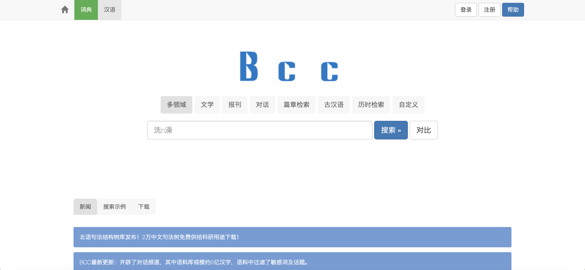

**简介：**

BCC语料库是以汉语为主，兼有英语、西班牙语、法语、德语、土耳其语等语言的语料库，其中汉语语料规模约150亿字，涵盖了报刊、文学、微博、科技、综合和古汉语等多领域语料。BCC语料库包括了生语料、分词语料、词性标注语料和句法树，目前已对现代汉语、英语、法语的语料进行词性标注。

---

### 北京大学CCL语料库

网址：http://ccl.pku.edu.cn:8080/ccl_corpus/index.jsp
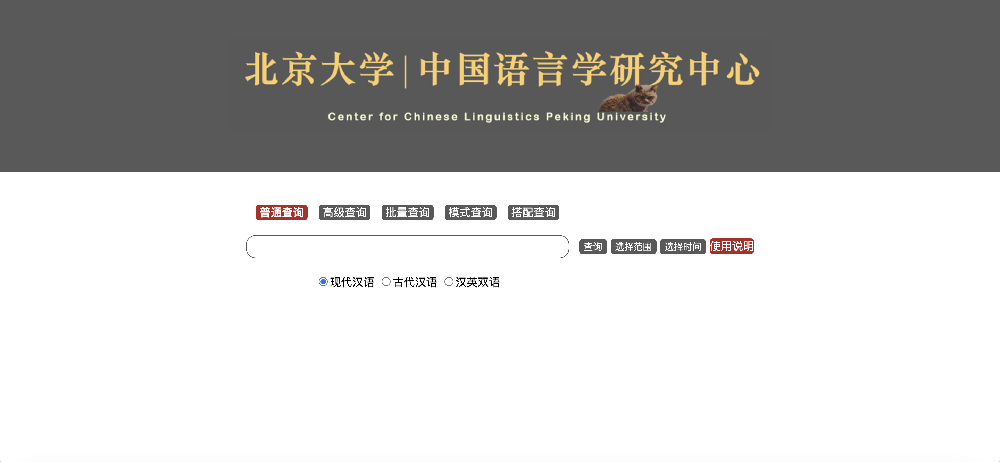

**简介：**

CCL语料库中包含现代汉语语料、古代汉语语料两类单语语料，涉及的文献时间从公元前11世纪到当代。其中现代汉语语料约６ 亿字符，涵盖了文学、戏剧、报刊、翻译作品、网络语料、应用文、电视电影、学术文献、史传、相声小品、口语等多个类型。CCL语料库中古代汉语语料约2亿字符，收录了从周代到民国的语料及大藏经、二十五史、历代笔记、十三经注疏、全唐诗、诸子百家、全元曲、全宋词、道藏、辞书、蒙学读物等的杂类语料。除了两大单语语料库的扩容外，近年来CCL语料库还融入了一些专题语料库，例如：早期北京话材料、留学生汉语作文语料、汉语构式语料库、中文学术文献语料库、海外华文网络语料等等。

---

### Ethnologue Database

网址：https://www.ethnologue.com/
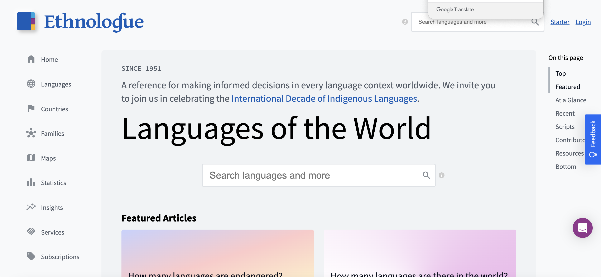

**简介：**

Ethnologue Database是一个权威的语言资源库，致力于记录和分析世界各地的语言。由SIL International（夏言国际）运营，Ethnologue提供了详尽的语言信息，包括语言的分布、使用者人数、方言、语言家庭和语言活力等方面的内容。

**主要功能：**

广泛的语言覆盖：Ethnologue记录了全球7000多种语言的信息，覆盖了世界上绝大多数的语言。每种语言都有详细的描述，帮助用户了解语言的基本特征和使用状况。

详细的语言信息：每种语言的条目包括语言名称、ISO 639-3代码、语言家庭、方言、使用者人数、地理分布、语言使用的社群情况以及语言的历史和发展等详细信息。

语言活力评估：Ethnologue对每种语言的活力进行评估，采用EGIDS（扩展的Graded Intergenerational Disruption Scale）量表来衡量语言的传承状况和使用的可持续性。这有助于识别濒危语言，并促进语言保护和复兴工作。

地图与可视化工具：Ethnologue提供了语言分布的地图和可视化工具，帮助用户直观地了解不同语言的地理分布和相互关系。这些地图和工具对于语言研究和教育具有重要意义。

更新与维护：Ethnologue定期更新其数据库，以确保信息的准确性和时效性。SIL International与全球各地的语言学家和研究机构合作，收集和验证语言数据。

研究与教育资源：Ethnologue是语言学研究、教育和政策制定的重要资源。它被广泛用于语言学家、教育工作者、政府机构和非政府组织的研究和工作中。

---

### Linguistic Data Consortium (LDC)

网址: https://www.ldc.upenn.edu/
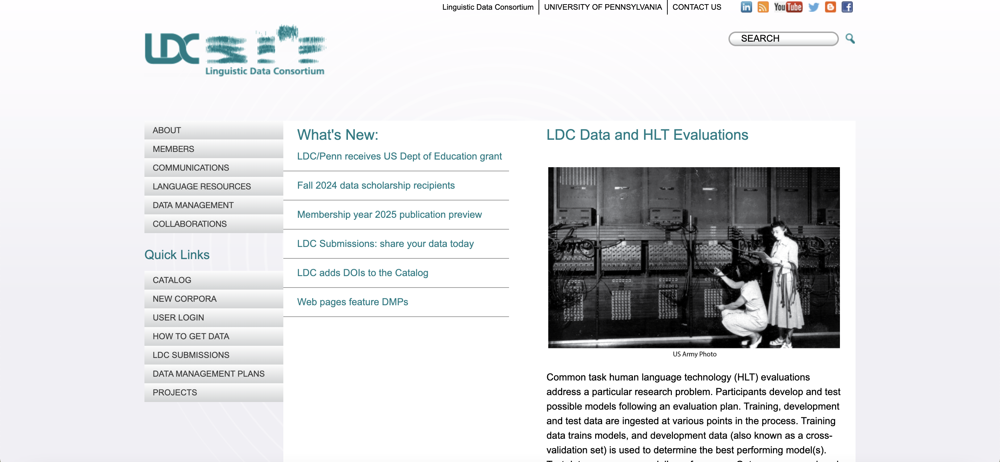

**简介：**LDC是一个非营利组织，提供丰富的语言数据资源和语料库，包括文本、音频和视频数据，支持语言学研究、自然语言处理和语言技术开发。

---

### SIL International

网址: https://www.sil.org/

**简介：**
SIL International专注于语言研究和语言发展，提供大量关于语言描述、语言学研究、词典、语法等资源，特别适合研究少数民族语言和濒危语言。

---

### Glottolog
网址: https://glottolog.org/
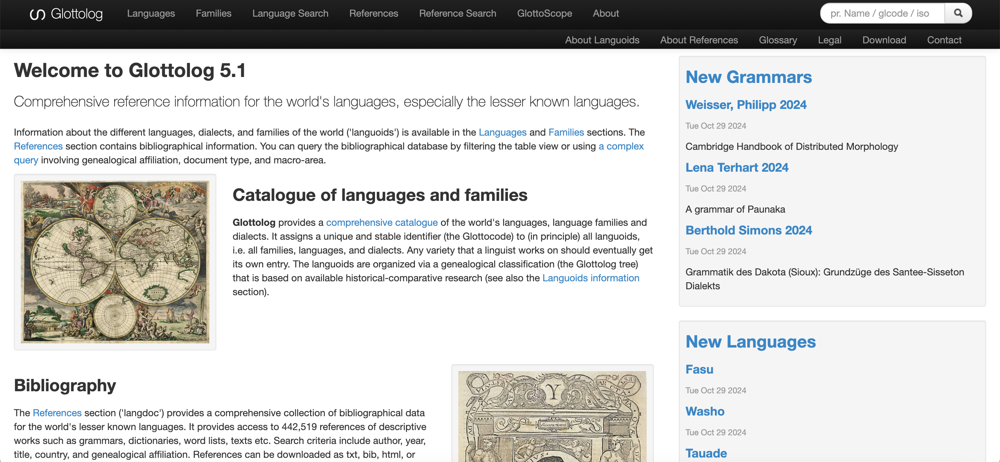

**简介：**
Glottolog提供全球语言和方言的详细信息，包括语言分类、参考文献、地理分布等，是语言学家研究语言家系和语言分类的重要资源。

---

### The World Atlas of Language Structures (WALS)

网址: https://wals.info/
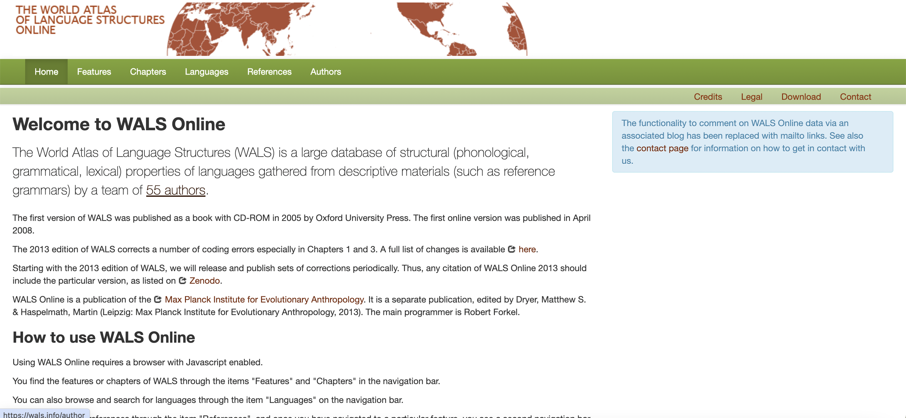

**简介：**
WALS是一个在线数据库，提供关于世界语言的结构特征和语法属性的信息，通过地图和数据分析展示语言结构的全球分布和比较。

---

### Google Books Ngram Viewer

网址: https://books.google.com/ngrams
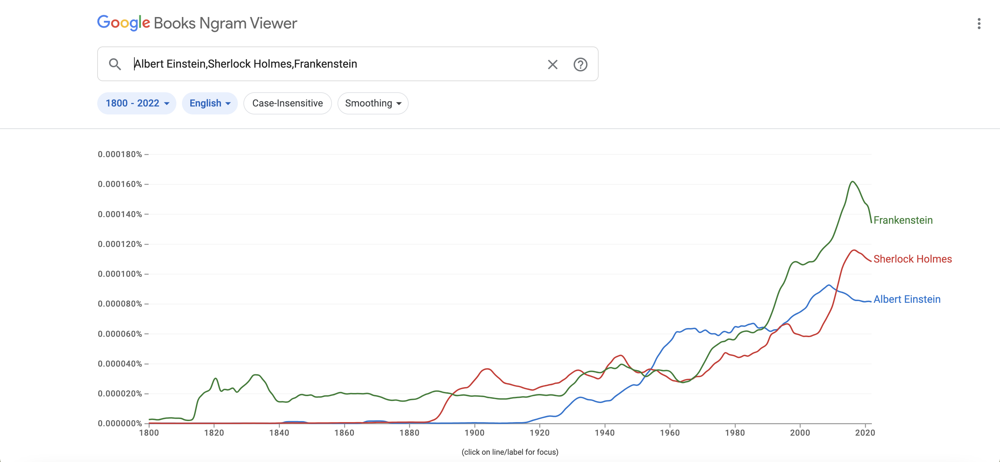

**简介：** 
Ngram Viewer允许用户在数百万册图书中搜索词汇和短语的使用频率，展示其历史趋势，适合研究语言变化和词汇使用趋势。

---

### CHILDES (Child Language Data Exchange System)

网址: https://childes.talkbank.org/

**简介：**

CHILDES提供儿童语言发展研究的语料库，包含跨语言的儿童语言录音和转录文本，支持语言习得和发展研究。

---

### International Phonetic Alphabet (IPA) Chart

网址: https://www.internationalphoneticalphabet.org/ipa-charts/
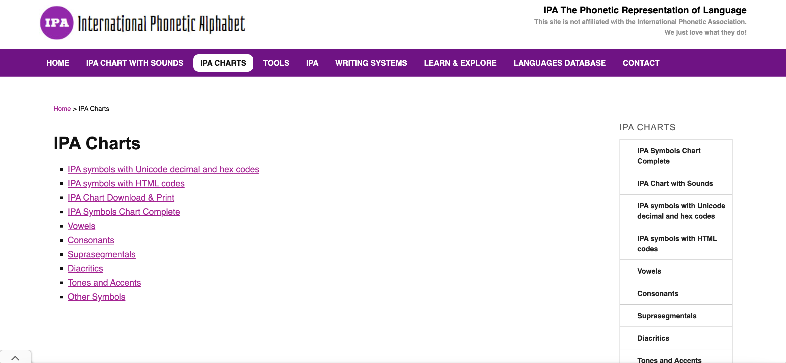

**简介：**

IPA Chart提供关于国际音标的详细信息，包括音标符号的发音、分类和应用，是进行语音学研究的基本工具。

---

### Language Bank of Finland

网址: https://www.kielipankki.fi/

**简介：**
提供丰富的语言数据和语料库资源，特别是关于芬兰语和其他北欧语言的资料，支持语言学研究和自然语言处理。

---

### Linguist List

网址: http://linguistlist.org/
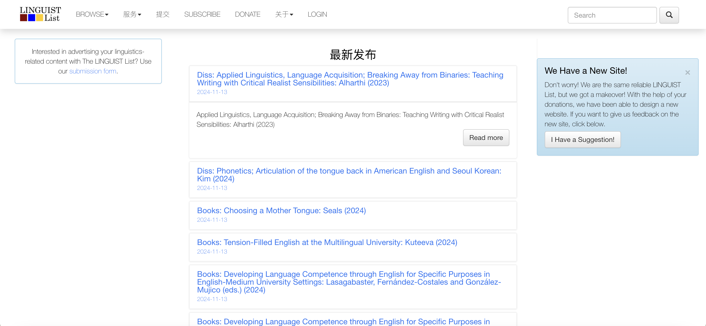

**简介：**
Linguist List是一个在线资源，提供全球语言学研究的最新动态、工作机会、会议信息和研究资源，是语言学界的重要交流平台。

---

### The British National Corpus (BNC)

网址: http://www.natcorp.ox.ac.uk/

**简介：**
BNC是一个100百万词的英语语料库，包含20世纪末期英国英语的广泛文本，支持语言研究和语言教学。
这些数据库和资源平台为语言学研究提供了丰富的数据和工具，涵盖了语言描述、语料库、语言习得、语音学和词汇使用等多个领域，支持广泛的语言学研究和教学活动。

---

## 文学

### 中华经典古籍库

网址：https://publish.ancientbooks.cn/docShuju/platformSublibIndex.jspx?libId=5
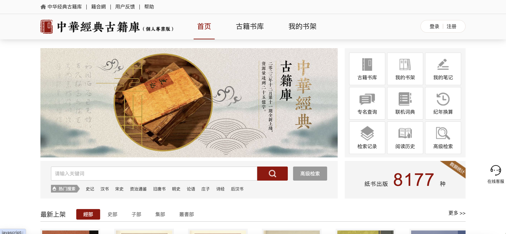

**简介：**
《中华经典古籍库》是中华书局首次推出的大型古籍数据库产品，收录了中华书局及其他古籍出版社出 版的整理本古籍图书，涵盖经史子集各部，包含了二十四史、通鉴、新编诸子集成、清人十三经注疏、史 料笔记丛刊、古典文学基本丛书、佛教典籍选刊等经典系列，保留专名线、注释、校勘记等整理成果。

---

### 北京大学中国语言文学系图书馆-数字资源

网址：https://lib.chinese.pku.edu.cn/zy/chdatabase

**简介：**
北京大学中国语言文学系图书馆的数字资源包括：中文在线期刊、在线辑刊、在线报纸、中文数据库、古代文献数据库、近现代文献数据库、当代文献数据库、外文数据库、语言类刊导航（SSCI）、语言类外文数据库、文学类外文数据库、自建数字资源、电子书、教参资料。其中提供了各种数字资源的详细介绍，方便同学们参考。

---

### 牛津大学档案馆

网址：https://ota.bodleian.ox.ac.uk/repository/xmlui/
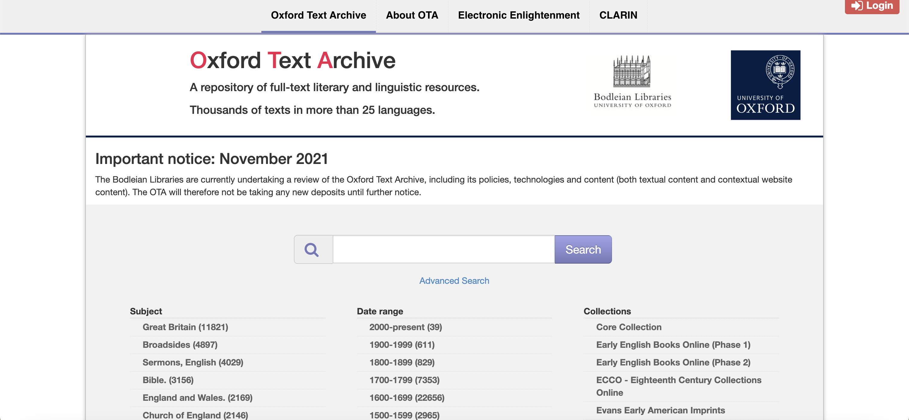

**简介：**
牛津大学档案馆负责促进、收集、分类和保存以高等教育、研究、教学为用途的数字化文学和语言学资源。同时提供相关资源的制作和使用的协助，并参与数字资源的标准化发展和基础设施的建设。

---

### 青空文库【日本文学】
网址：https://www.aozora.gr.jp/
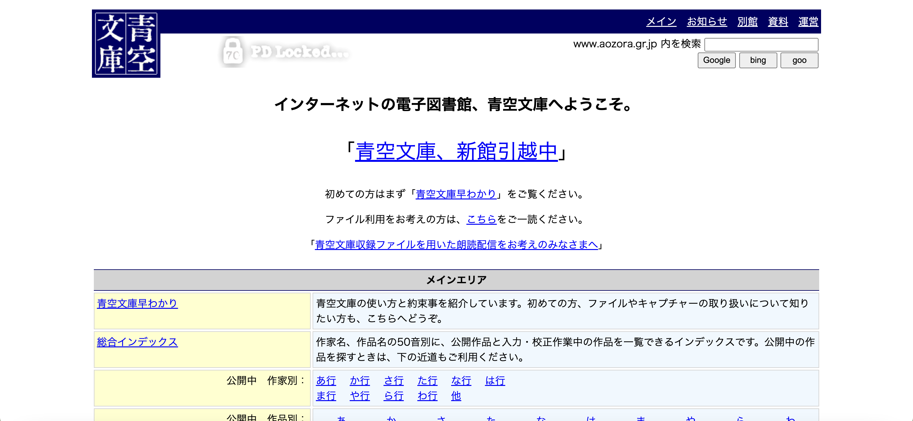

**简介：**
青空文库是日本著名的免费在线图书馆，由富田伦生创建于1997年，目前已经收录了超过一万册的作品，青空文库收录的大多是日本名家的小说，具有很高的阅读和研究价值，对日语学习者和日语研究者来说是难能可贵的资源。日本著作权法规定，著作人死后50年著作权将消失，故青空文库目前搜集的作品以明治至昭和初期居多。2012年4月时，收录了约11000份文献。包括森鸥外（1922年过世）、夏目漱石（1916年）、芥川龙之介（1927年）、中岛敦（1942年）、太宰治（1948年）、林芙美子（1951年）、宫本百合子（1951年）、堀辰雄（1953年）、坂口安吾（1955年）、高村光太郎（1956年）、永井荷风（1959年）的作品。

---

### Gallica【法语文学】

网址：https://gallica.bnf.fr/accueil/fr/content/accueil-fr?mode=desktop
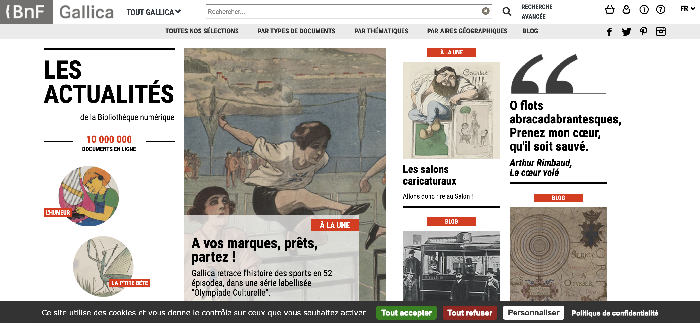

**简介：**
Gallica是法国国家图书馆的数字化项目，提供了大量的法语文献资源。这个数据库的收录范围非常广，包括图书、手稿、地图、图片、音乐等各种类型的材料，而且都是免费开放的，用户可以随时随地进行在线阅读或者下载。不仅如此，Gallica还提供了多种搜索方式，如关键词搜索、高级搜索、主题搜索等，方便用户快速精确地找到所需的资源。

---
