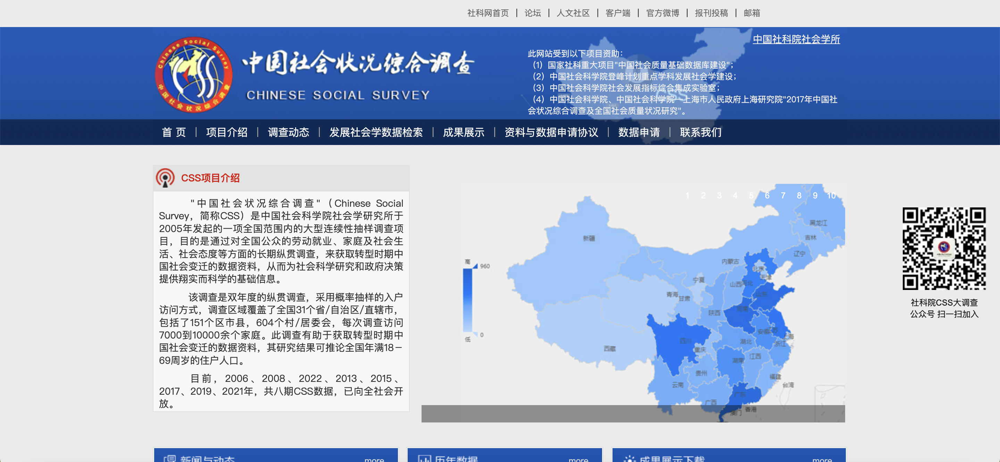
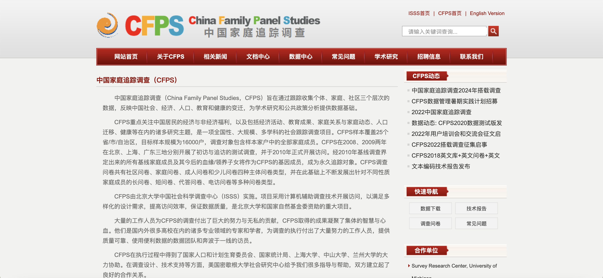

# 社会科学类
## 社会科学

### 中国综合社会调查数据CGSS

网址：http://www.cnsda.org/index.php?r=site/datarecommendation

中国综合社会调查（Chinese General Social Survey，CGSS）始于2003年，是我国最早的全国性、综合性、连续性学术调查项目。CGSS系统、全面地收集社会、社区、家庭、个人多个层次的数据，总结社会变迁的趋势，探讨具有重大科学和现实意义的议题，推动国内科学研究的开放与共享，为国际比较研究提供数据资料，充当多学科的经济与社会数据采集平台。目前，CGSS数据已成为研究中国社会最主要的数据来源，广泛地应用于科研、教学、政府决策之中。
2003-2008年是CGSS项目的第一期，共完成5次年度调查（2007年没有执行），生产出5套高质量的年度数据。除2004年的调查数据，剩下的年度数据都已在中国国家调查数据库（China National Survey Data Archive，CNSDA）的网站（cnsda.ruc.edu.cn）上发布，到目前为止，用户可免费申请使用。

执行机构：中国人民大学中国调查与数据中心

开放数据年份：2003、2005、2006、2008、2010、2011、2012、2013

时间跨度：分两期，第一期：2003年—2008年2008年，每年一次；第二期：2010年—2019年，每两年一次。最新公开数据：CGSS2013。

数据类型：截面数据

核心问题：中国社会变迁（文化、健康、家庭、劳动力、就业、消费、教育、心理、个性等）

应用主题：人口健康分析、劳动就业分析、消费储蓄分析、空间规划分析\社会流动、幸福感、社会信任、教育回报、宗教信仰、政治参与等。

**主要功能： **

1.检索数据：可根据关键词、类别、执行时间、地理区域进行检索。

2.存储数据：保存机构和个人有知识产权的数据。

3.管理数据：中心会对收集的数据按照国际标准进行管理。

4.分析数据：在某个指标上进行横向比较 。

---

### 中国社会状况综合调查（CSS）

网址：http://css.cssn.cn/css_sy/

**简介：**

“中国社会状况综合调查”（Chinese Social Survey，简称CSS）是中国社会科学院社会学研究所于2005年发起的一项全国范围内的大型连续性抽样调查项目，目的是通过对全国公众的劳动就业、家庭及社会生活、社会态度等方面的长期纵贯调查，来获取转型时期中国社会变迁的数据资料，从而为社会科学研究和政府决策提供翔实而科学的基础信息。

该调查是双年度的纵贯调查，采用概率抽样的入户访问方式，调查区域覆盖了全国31个省/自治区/直辖市，包括了151个区市县，604个村/居委会，每次调查访问7000到10000余个家庭。此调查有助于获取转型时期中国社会变迁的数据资料，其研究结果可推论全国年满18－69周岁的住户人口。

为了兼顾纵贯调查的连续性和社会议题的现实性， CSS的调查问卷在设计上分为基础模块、更替模块和热点模块三个部分。其中基础模块固定不变，包含了个人基础信息、劳动与就业、家庭结构、家庭经济状况等内容；更替模块如社会阶层地位流动、社会保障、休闲消费、社会价值观等，隔一定周期后重复调查；热点模块则与时俱进，目前已进行了社会群体利益关系、民生问题、城镇化等主题的研究。

---

### 中国家庭追踪调查数据CFPS

网址：https://www.isss.pku.edu.cn/cfps/

**简介：**

“中国家庭追踪调查“（CFPS）重点关注中国居民的经济与非经济福利，以及包括经济活动、教育成果、家庭关系与家庭动态、人口迁移、健康等在内的诸多研究主题，是一项全国性、大规模、多学科的社会跟踪调查项目。CFPS样本覆盖25个省/市/自治区，目标样本规模为16000户，调查对象包含样本家户中的全部家庭成员。CFPS在2008、2009两年在北京、上海、广东三地分别开展了初访与追访的测试调查，并于2010年正式开展访问。经2010年基线调查界定出来的所有基线家庭成员及其今后的血缘/领养子女将作为CFPS的基因成员，成为永久追踪对象。

执行机构：北京大学中国社会科学调查中心数据

开放数据年份：2008、2009（测试性调查，北京、上海、广东）；2010（基线调查）；2011（维护调查）；2012年以后每年一次跟踪调查。最新公开数据：CFPS2016（追访）调查数据。

数据类型：面板数据

分析单位与调查规模：社区、家庭、个人（成人、少儿）；基线调查为16000户。CFPS调查问卷共有社区问卷、家庭问卷、成人问卷和少儿问卷四种主体问卷类型，并在此基础上不断发展出针对不同性质家庭成员的长问卷、短问卷、代答问卷、电访问卷等多种问卷类型。

覆盖区域：中国25个省市，2010年在全国（西藏、青海、新疆、宁夏、内蒙古、海南、香港、澳门、台湾不在其列）正式实施。

核心问题：中国社会、经济、人口、教育和健康的变迁

应用主题：人口健康分析、劳动就业分析、消费储蓄分析、空间规划分析、质量管理

**主要调查项目：**

家庭：生活条件、家户各类收入与支出、住房、金融资产等

成人：基本信息、教育、婚姻、工作、健康、退休与养老、认知、宗教等

少儿：基本信息、日常生活、健康、教育、培训辅导、认知能力等

其中，村/居问卷的调查内容包括：村/居基础设施概况、人口和劳动力资源概况、自身及周边环境、基层选举、财政收入与支出，以及日常消费品价格等。

家庭问卷的调查内容包括：家庭成员结构、日常生活基本设施、社会交往、住房、家庭经济、农业生产与销售等。

成人问卷的调查内容包括：教育、婚姻、职业、日常生活、健康、养老、社会保障、社会交往、价值观、以及基准测试等。

少儿问卷的调查内容包括：学业情况、日常生活、健康、职业期望、与父母关系、成长环境、社会交往、价值观、以及基准测试等。

---

### 复旦大学社会科学数据平台
网址：https://dvn.fudan.edu.cn/home/ 

**简介：**

复旦大学社会科学数据平台收集、整理和开发中国社会经济发展数据，为学者提供有最具竞争力的研究条件和数据服务，为学生提供更加坚实的社会科学调查方法和应用的训练，鼓励跨学科的研究，为复旦大学履行大学传承、记录文明的职责和成为“国家智库”提供重要和基础性的支撑。复旦大学社会科学数据研究中心，在2012年经过广泛的调研包括对美国多所著名高校实地考察，最后决定和哈佛大学进行合作，2013年3月和哈佛大学的Dataverse Network系统签署了全面合作协议。复旦大学不仅是Dataverse Network的使用者，更是哈佛大学的合作伙伴，帮助共同推进Dataverse的国际化和新功能的开发。

复旦大学全面负责Dataverse中文版的研发和中国地区的宣传推广，2013年6月正式发布Dataverse汉化3.3版本，致力于为Dataverse中文版用户提供技术支持服务。

该网站提供了丰富的数据资源，还有“数字素养“、”数据教学“等模块可以学习。

数据类型：研究论文、学位论文、研究报告、政策法规、专项调查及统计年鉴。

核心业务： 数据服务、定量研究方法教学、跨学科研究  

**主要功能：**

数据检索：根据课题进行检索； 

数据下载：访问受限，仅对高校、政府及科研机构开放。 

附：[复旦大学社会科学数据研究中心](http://fisr.fudan.edu.cn/)提供了社科方面的动态资讯

---

### nter-university Consortium for Political and Social Research（Michigan）

网址：http://www.icpsr.umich.edu

**简介：**

ISPSR于1962年成立于美国密西根大学安娜堡分校，以大量收集系统化的社会科学数据著称，是世界上最大的社会科学数据中心。 

ICPSR研究涉及21个领域，如教育、老龄化、刑事司法、恐怖主义等，储存了超过 50万种社会科学研究资料，包含一个拥有25万份关于研究社会和行为科学文件的档案库。 

用户群体：来自40多个国家的700多个成员机构，包括大学和研究中心等。每年网站访客超过60万，每月有5.2万个数据文件下载。

数据来源：儿童和家庭机关、卫生部门和公共事业，Alfred P. Sloan基金、Henry Luce基金、美国心理协会、卫生与人类服务部疾病预防控制中心、联合国粮食和农业组织、博物馆与图书馆服务研究所、全国大学生体育协会、国家艺术基金会、国家儿童健康和人类发展研究院、国家老化研究所、国家药物滥用研究所、国家科学基金会、司法部司法程序办公室、Robert Wood Johnson基金会、Spencer基金会、美国国际开发署、美国退伍军人事务部等。 

**主要功能：**

数据搜索：根据关键词搜索数据、数据相关文献、研究资源还可检索和对比变量； 

数据上传：定量数据；定性数据：面试、半结构化访谈、结构化面试、非结构化或半结构化日记、野外观测笔记、案例研究、会议记录、新闻剪报、法庭记录等；其他类型：如视频和录音等需与管理员商定如何存储； 

数据下载：下载的数据支持SAS/SPSS/STATA/ASCII/ EXCEL格式； 

线上线下交流：每年都有关于社会调查定量方法的夏令营和课程。 

---

### 台湾调查研究与数据档案库

网址：http://srda.sinica.edu.tw/

“學術調查研究資料庫”蒐集、保管及整理各類問卷調查資料，並採會員制對外開放資料使用。資料來源包括各大專校院、研究機構進行的學術研究調查計畫，以及政府部會應業務規劃及施政決策需要所辦理的調查統計。

網站上可供查詢使用的資料超過2千筆，涵蓋社會、政治、經濟、教育等社會科學重要領域，其中包含多項長期進行的主題型或追蹤調查。各筆資料提供資料檔、問卷、研究報告、資料使用說明，以及利用該資料發表的著作書目。 

這些資料可作為調查方式或問卷設計之參考，或以不同的研究假設、方法進行分析，產生新的研究成果，亦可以應用於教學活動中，有助於提升學生的統計分析與研究能力。 

除在網站提供數位課程及在YouTube平台設立SRDA頻道之外，每年也會舉辦資料使用工作坊、研習班、網路研討會，以及提供到校推廣課程服務等，以期觸及更多潛在的資料使用者，並讓資料能被廣泛運用，發揮最大價值。 

---

### 欧洲社会调查（ESS）

网址：http://www.europeansocialsurvey.org/data/ 

欧洲社会调查（ESS）成立于2001年，是一个欧洲范围内的跨国调查，主要目的是了解社会结构的稳定与变化，解释欧洲社会、政治、道德结构是如何变化的。研究来自欧洲30多个国家的多样化的人群的态度、信念和行为模式。 

研究领域：媒体和社会信任、政治、主观幸福感、性别与家庭、社会人口统计、人类价值观、移民、公民参与、健康与保健、家庭和幸福工作、寿命、个人幸福、福利、年龄歧视、正义、民主、健康方面的社会不平等、公众对气候变化的态度。

**主要功能：**

数据检索：通过关键词检索，并通过年份、周期和国家查找数据； 

数据分析：交叉表/相关/回归/权重/做图/做表； 

数据下载：问卷（PDF）、报告（PDF）、数据（spss、sas、stata）。

---

### GESIS

网址：http://www.gesis.org/en/services/data/

**简介：**
GESIS成立于1986年，是德国最大的社会调查机构，目前有300名员工为研究者提供大量的、全面的、国际相关的调查；其专业的知识和服务随时准备回答各级研究人员在最新科学方法基础上与社会相关的问题。

研究领域：调查方法、应用计算机和信息科学和社会科学调查。 

在研项目有：女性和性别调查、历史调查、社会指标调查、社会结构分析、选举与政治研究、价值观与态度研究。 

**主要功能：**

数据检索：通过领域、种类和主题进行查找； 

数据分析：分析功能包括交叉表/相关/回归/权重/作图/重新编码（NESSTAR、NSDStat）； 

线上线下交流：针对社会研究方法的培训，发展覆盖在整个研究周期的研究技能的深度培训。 

---

### Center for Social Research on Japan ：Social Science Japan Data Archive日本社会科学数据档案

网址：http://csrda.iss.u-tokyo.ac.jp/en/

**简介：**

日本社会调查信息中心2009年由东京大学创建，它是一个日本社会调查数据的综合档案库，负责收集、编制、数字化日本社会的微观数据，目的是促进社会调查数据的再次利用。

数据主要内容：仅包含JGSS一个项目的数据（类似于中国的CGSS）。

 
1998年-2015年底，SSJDA共有可用数据集1935个，申请者数量累计22907人，数据提供者累计35759人，累计发表文章1692篇，使用在线搜索系统的累计569017人次，访问的数据列表累计148332次。 

用户群体：研究人员和学生 

**主要功能： **

数据检索：通过主题、关键词和调查组织进行查找。 

数据分析：数据分析功能包括交叉表/相关/回归/权重/做图/做表； 

数据上传：步骤：填写微数据存款表格→向SSJDA提供软盘、CD或磁光（MO）光盘上的数据副本→提交调查报告和说明方法、数据格式及编码程序的材料、调查问卷→回

复SSJDA的任何查询问题，可接受的文件格式包括TEXT/SPSS/SAS/Excel/Lotus； 

数据下载：注册之后通过使用申请可以进行下载。

---

### Korean Social Science Data Archive 

网址：http://www.kossda.or.kr/

**简介：**

于1983年由Lee Inpyo基金会创立，其主要目标是汇编和提供韩国定量和定性数据以及文献的综合数字档案。 

研究领域：政治、公共行政和法律、经济和商业管理、社会文化、社会问题、社会福利、心理学和教育和区域研究。 

用户群体：个人和组织。个人主要包括学生、学者和研究人员；组织主要包含学校图书馆、研究机构公有或私有组织。 

**主要功能： **

数据检索：可以通过标题、调查者/作者、出版者、关键词、变量、摘要和数据类别进行查找； 

数据分析：使用Nesstar进行数据分析，主要功能包括交叉表/相关/回归/权重/做图/做表； 

数据上传：接受韩国研究数据和文献，定量数据需要提供的材料包括数据、元数据和调查问卷、收集方法、代码本和编码指南；定性数据包括录像带、照片、CD、盒式磁带；文献包括基于研究数据的研究专著或者不是基于存储数据的研究专著。 

数据下载：会员用户可以请求数据用于研究、教育或浏览，非会员大学教师可以仅请求数据用于教育。每年最多允许下载30个定性和定量的数据，数据下载的有效期为1年； 

线上线下交流：提供数据分析方法的高级培训。

---

### 马德里社会调查中心（CIS）
http://www.cis.es/

CIS是马德里社会调查中心的简称。该中心主要通过开展定量、定性研究以此来分析并推进西班牙社会科学知识的发展。研究主要通过两种方式开展：中心自身开展或通过与公共机构或非营利组织合作来实现。 

研究领域：选举调查、有关青年、移民、生活、公共安全、政治文化的专题调查、消费者信心指数和国际调查。 

平台主要功能： 

数据检索：通过关键字进行搜索； 

数据分析：交叉分析/作图/做表； 

线上线下交流：包括对专业人士提供生产和统计数据分析的培训；对大学毕业生提供社会研究技术的培训，侧重于数据收集、分析、解释和演示；对研究生的实习，包括调查活动、管理、编辑文件和其他任何相关的时间活动；研究人员在社会科学方法论和实证研究的研讨会。 

---

## 政治学

### United Nations Documentation联合国文件

网址：https://documents.un.org/

---

### 世界银行数据与统计 World Bank Group – Data and Statistics

网址：https://data.worldbank.org/

---

### 剑桥政治类数据库

网址：https://www.cambridge.org/core

**简介：**

剑桥政治类数据库是由剑桥大学出版社提供的一种在线资源，收集了全球范围内的政治数据。该数据库的内容包括书籍、期刊文章、报告、统计数据等，覆盖了国内和国际政治的各个方面。剑桥政治类数据库的特点是权威性和广泛性。它的数据来源于全球的政治学家、历史学家、经济学家等各领域的专家，因此具有很高的可信度。此外，其数据的类型和主题也非常广泛，可以满足不同用户的需求。

---

### PROQUEST政治科学数据库

网址：https://about.proquest.com/en/products-services/polysci/

**简介：**

ProQuest政治科学数据库是一个专门为研究政治学领域的学者和学生设计的数据库。这个数据库收集了大量的政治学期刊、会议论文、学位论文以及相关的政策文件。ProQuest政治科学数据库的特点是内容丰富和更新频繁。它的数据来源于全球各地的政治学研究机构，因此可以提供最新的研究成果和政策动态。
 
---

## 法学

### 中国裁判文书网

网址: http://wenshu.court.gov.cn/

 
**简介：**
中国裁判文书网是中华人民共和国最高人民法院于2013年建立的全国法院统一的裁判文书公开平台，也是司法公开三大平台（审判流程公开、裁判文书公开、执行信息公开）之一，内容可供普通公众查阅。

---

### Westlaw

网址: https://legal.thomsonreuters.com/en/westlaw

**简介：**
Westlaw International是先进的电子技术与全球范围资料库的完美结合，其丰富的资源来自法律、法规、税务和会计信息出版商。 用户可以通过Westlaw International迅速地存取案例、法令法规、表格、条约、商业资料和更多的资源。 通过布尔逻辑搜索引擎，用户可以检索数百万的法律文档。

---

### LexisNexis

网址: https://www.lexisnexis.com/

**简介：**

律商联讯是一家全球领先的法律、监管、商业信息和分析提供商，帮助客户提高生产力、改善决策和结果，并在世界各地推进法治工作。 RELX 集团是律商联讯的母公司，是一家为专业商务人士提供基于信息的分析和决策工具的全球供应商，为全球180 多个国家/地区的客户提供服务。

---

### HeinOnline

网址: https://home.heinonline.org/

**简介：**
HeinOnline 是全球领先的法律及政经全文数据库之一，现收录2800 多种法学期 刊， 15000 多部精品法学学术专著以及美国联邦和各州的案例，覆盖国际法、比较 法、人权法、刑法、知识产权法等核心学科，能够满足法学专业师生学习与科研需求。

---

### JSTOR 法律研究文献

网址: https://www.jstor.org/

**简介：**
JSTOR全名为Journal Storage，是一个对过期期刊进行数字化的非营利性机构，于1995年8月成立。目前JSTOR的全文库是以政治学、经济学、哲学、历史等人文社会学科主题为中心，兼有一般科学性主题共48个领域的代表性学术期刊的全文库。从创刊号到最近两三年前过刊都可阅读全文。有些过刊的回溯年代早至1665年。2012年，JSTOR推出电子书项目—Books at JSTOR，将电子书与电子期刊在同一平台上进行整合并提供服务。

---

### SSRN 法律研究网络

网址: https://www.ssrn.com/

**简介：**
社会科学研究网（SSRN，Social Science Research Network）创建于1994年，是一个致力于快速地在世界范围内传播社会科学研究成果的网站。它是由大量的各个社会科学分支专门研究网络组成，并组成了一些专门的研究网络。截至2020年3月份，SSRN 已经收录包括财经、会计、法律、经济、管理等50多个领域的 91万篇预印本文章，并提供热门文章和作者的排名信息。2016年7月，SSRN被爱思唯尔公司收购，仍继续提供免费的论文提交、存储服务。

---

### 世界银行法律资源

网址: https://legalvicepresidency.worldbank.org/

**简介：**
世界银行提供的法律资源，包括法律研究报告、法律援助项目、国际法律框架和政策建议，适合研究国际法和发展法学。

---

### 联合国条约数据库（UN Treaty Collection）

网址: https://treaties.un.org/

**简介：**
联合国条约系列（UN Treaty Series）：联合国条约系列是世界上最重要的条约数据库之一，由联合国秘书处负责管理和维护。 该数据库收录了自1945年以来所有在联合国登记的国际条约和协定，并提供多种语言版本的条约文本。 用户可以通过该数据库查询和下载相关条约的全文和摘要信息。
